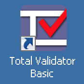
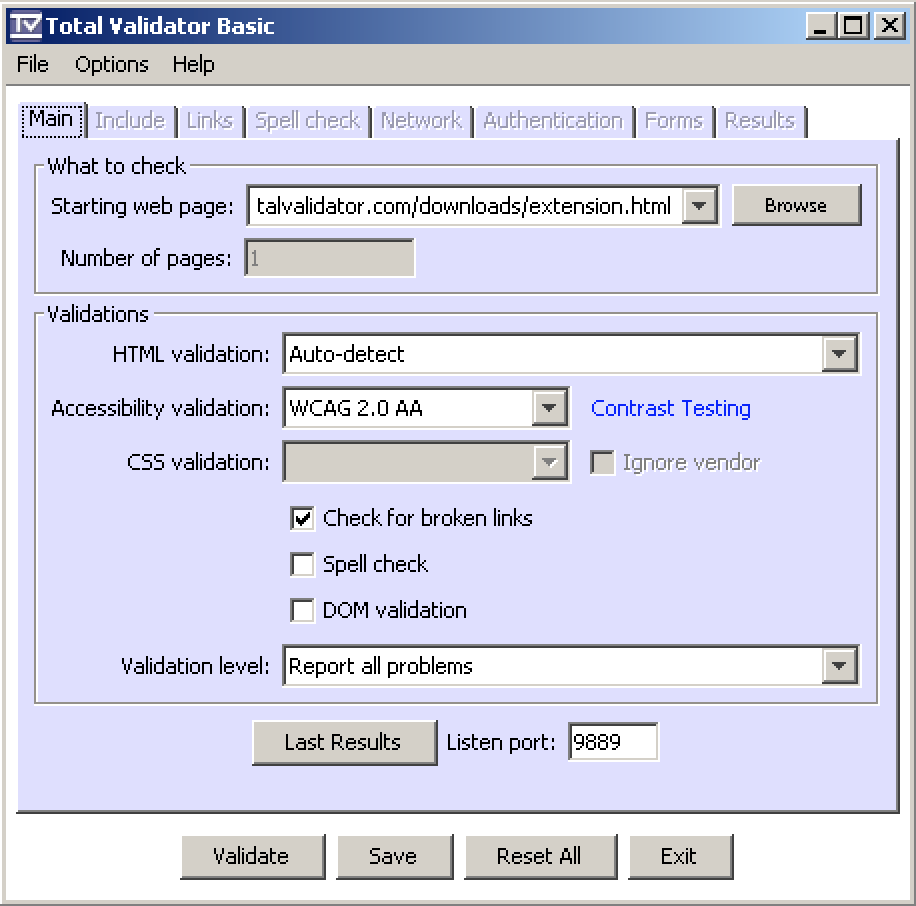

# TotalValidator

**TotalValidator checks your website regarding various web and accessibility standards by the press of a button. Building valid code is one of the highest goals developers should strive for. TotalValidator helps a lot with achieving this.**

## Installation

[Download TotalValidator](https://www.totalvalidator.com/downloads/index.html) and run the installer. Then install [Chrome and Firefox extensions](https://www.totalvalidator.com/downloads/extension.html).

## Configuration

Under `Validations`, we recommend to disable `Check for broken links`, as it slows the tool down.

## Usage

After launching it, open your website in either Firefox or Chrome, and activate TotalValidator by clicking its icon in the browser toolbar.

Inspect the displayed results.

