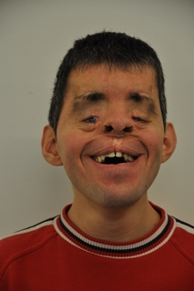

# The ADG Team

This guide is written and maintained by a small team of web developers and accessibility consultants, employed by the foundation [«Access for all»](http://www.access-for-all.ch), based in Switzerland.

# Joshua Muheim

{.image}

I'm working as a full stack web developer (frontend and backend) for more than 10 years. My motto has always been:

> **Good code** is **clean** code is **less** code is **maintainable** code is **accessible** code.

I'm working for «Access for all» since 2014, and being the first qualified web developer in the team, I'm heavily pushing our services for other web developers, as **it's absolutely crucial that disabled people and the web industry are working together tightly**. This makes it possible that modern digital media is highly usable for both disabled an non-disabled people. And that's the reason why I started the present project: so **I'm the spiritual father of the «Accessibility Developer Guide»**.

Besides this, I'm holding public and in-house [workshops for developers](http://www.access-for-all.ch/ch/schulung/kurse-und-seminare.html), auditing websites and mobile apps on accessibility and conducting consulting about all topics accessibility.

# Anton Bolfing

{.image}

TODO

# Petra Ritter

{.image}

I'm working as an accessibility consultant for «Access for all» since it was founded 15 years ago.

I suffer from [hemiplegia](https://en.wikipedia.org/wiki/Spastic_hemiplegia) since birth and I'm visually impaired as well. I control my computer using a standard keyboard with one hand a braille display. **I'm using screenreaders and other assistive technologies on a daily basis** and can offer a lot of experience in this area. As part of my job I do thorough website and mobile app testing including analysis of code.

# Daniele Corciulo

{.image}

TODO

# Gianfranco Giudice

{.image}

TODO