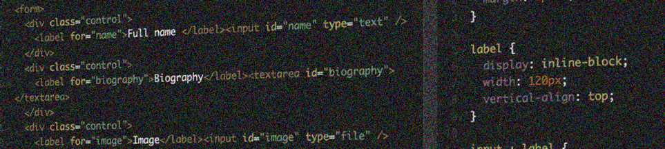

# Accessible heading outlines

Like a book's table of contents, a proper heading hierarchy allows screen reader users to quickly get an overview over the available areas and contents of a page.

{.image}

Like any traditional book, accessible websites mark up all their areas (header, main content, aside, footer, etc.) and contents using a proper heading hierarchy.

# TL;DR - Too long, didn't read

First things first: you need to [learn to browse headings](/code-examples/accessible-heading-outlines/how-to-browse-headings){.page title="How to browse headings"} using screen readers! We also present you some [quick tools for examining heading outlines](/code-examples/accessible-heading-outlines/quick-tools-for-examining-heading-outlines){.page title="Quick tools for examining heading outlines"}.

We begin by explaining that [website content should be structured properly using headings](/code-examples/accessible-heading-outlines/general-headings-example){.page title="General headings example"} - very similar to books! This is followed by a [demonstration about what typically can go wrong](/code-examples/accessible-heading-outlines/bad-beadings-example){.page title="Bad beadings example"} when developers aren't mindful and forget about proper semantics and logic of textual content.

Not only a page's main content - also recurring areas such as header, footer, and navigation need to provide proper headings! To not destroy the visual design, such headings can be inserted by as [visually hidden headings](/code-examples/accessible-heading-outlines/adding-visually-hidden-headings-to-complete-a-pages-outline){.page title="Adding visually hidden headings to complete a page's outline"}.

We then address some often posed [concerns about search engine optimisation](/code-examples/accessible-heading-outlines/search-engine-optimisation-concerns){.page title="Search engine optimisation concerns"} and explain, why we think that a page absolute can (and should) have more than a single heading on level 1. And for those who aren't convinced, we provide some alternate solutions with only a single heading on level 1. Yay!

{.image}

While headings are the most widely known technique to label page regions, there exist [other ways to label content](/code-examples/accessible-heading-outlines/alternative-techniques-for-labelling-page-regions){.page title="Alternative techniques for labelling page regions"} in HTML.

Six heading levels aren't enough? Check out how you can [exceed the heading level limit](/code-examples/accessible-heading-outlines/exceeding-available-heading-levels-using-aria){.page title="Exceeding available heading levels using ARIA"} using ARIA!

We then explain why the seemingly genius [HTML5's heading algorithm](/code-examples/accessible-heading-outlines/html5s-headings-outline-algorithm){.page title="HTML5's headings outline algorithm"} is not accessible - and why it is expected to removed from HTML soon.

Finally, the [FAQ](/code-examples/accessible-heading-outlines/faq---frequently-asked-questions){.page title="FAQ - frequently asked questions"} gives answers to many more everyday questions.