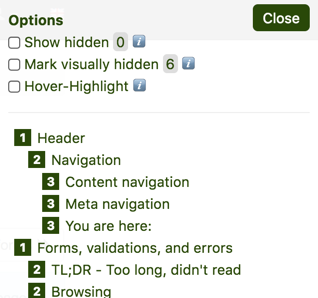
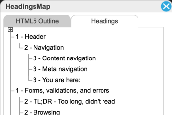
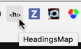
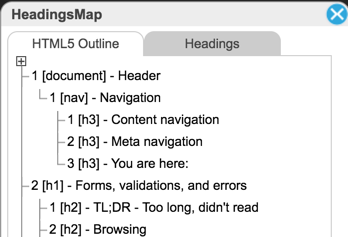

# Quick tools for examining heading outlines

There are various tools that help examining the accessibility of heading outlines. We show here our favourites.

In addition to the outlining features of screen readers (see [How to browse headings](/code-examples/accessible-heading-outlines/how-to-browse-headings){.page}), there are some useful "quick" tools that try to accomplish similar tasks.

# h123 bookmarklet

{.image}

The h123 bookmarklet is an efficient way to display a web page's heading outline.

## Installation

Go to [hinderlingvolkart.github.io/h123](https://hinderlingvolkart.github.io/h123) and add the link "Show Headings" to your bookmarks.

## Usage

Browse to the page you want to test and execute the bookmarklet by clicking on it. You should see a popover outlining the page's heading hierarchy on the top right of the page. In addition to this, it has some very useful optional features:

- Activate "Show hidden" to also display headings that are hidden from all channels
    - This is useful to debug headings that maybe have been completely hidden unintentionally (e.g. by using `display: none` instead of moving out of the viewport, see [Hiding elements correctly](/code-examples/hiding-elements-correctly){.page})
- Activate "Mark visually hidden" to see which of the present headings are visually hidden (moved out of the viewport)
- Activate "Hover-Highlight" to visually display the heading that corresponds to the element below the mouse cursor
    - This is useful to debug whether the current heading hierarchy is correct

After using it, you should reload the page (as the bookmarklet loads an external jQuery which may cause side effects).

## Disclaimer

This bookmarklet relies on [jQuery's `:visible` selector](https://api.jquery.com/visible-selector/). Screen readers may have other opinions about what exactly should be treated as visible, so always use a screenreader as a reference!

Especially, this bookmarklet **doesn't** take into account elements with `role="heading"`.

**We highly advise you only use tools that you know are accurate, or of whose inaccuracies you are aware!**

## NVDA vs. iOS VoiceOver

We know about a difference between NVDA and VoiceOver when it comes to the decision about when something should be treated as visible. While iOS VoiceOver needs `width` or `height` of at least `1px` to treat an element as visible, NVDA doesn't. So iOS seems to be more conservative than NVDA.

The good thing: this bookmarklet is conservative, too, and may reveal such problems.

Be sure to hide your headings correctly! Find out here how to do this: [Hiding elements correctly](/code-examples/hiding-elements-correctly){.page}.

## Credits

Thanks to [Severin Klaus](http://www.severinklaus.com/) from [Hinderling Volkart](http://www.hinderlingvolkart.com/) who provided us this bookmarklet.

# HeadingsMap

{.image}

Like the "Visible Headings" bookmarklet, HeadingsMap offers a quick way to examine the current page's headings outline. It is much less accurate though, see disclaimer below!

## Installation

HeadingsMap is a browser extension which is available for both Firefox and Chrome:

- [HeadingsMap Firefox](https://addons.mozilla.org/de/firefox/addon/headingsmap/)
- [HeadingsMap Chrome](https://chrome.google.com/webstore/detail/headingsmap/flbjommegcjonpdmenkdiocclhjacmbi)

## Usage {.clear}

Browse to the page you want to test and execute the extension by clicking on its icon: {.image}

You should see a popover describing the page's heading outline on the top right of the page.

## Disclaimer

HeadingsMap is much less accurate than a screen reader. For example, it also displays headings that are definitely hidden from screen readers (e.g. using CSS `display: none` or `visibility: hidden`).

**We highly advise you only use tools that you know are accurate, or of whose inaccuracies you are aware!**

## HTML5 outline

{.image}

HeadingsMap offers an HTML5 Outline, which can be interesting to take a glimpse at. From an accessibility point of view, the HTML5 outline algorithm isn't an option though, more info here: [HTML5's headings outline algorithm](/code-examples/accessible-heading-outlines/html5s-headings-outline-algorithm){.page}.