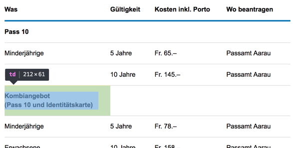

# FAQ - frequently asked questions

TODO

# How are sub-headers implemented in a table?

Problemfall: <https://www.ag.ch/de/dvi/persoenliches_zivilstandswesen/pass_id/kurzuebersicht/kurzuebersicht_1.jsp>

{.image}

Wie müsste man das korrekt lösen? Mittels aria-describedby oder so??

Auch spannend: <https://www.bfs.admin.ch/bfs/de/home/statistiken/bevoelkerung.html>

Mehrere <th> auf einer Zeile scheinen vom JAWS ausgegeben zu werden, aber nicht vom NVDA (war das schon immer so?)!

SBB führt einfach Headings ein, um das Problem zu lösen! Immer in erster Zelle einer Reihe ein entsprechendes Heading. Ungewöhnlich, aber irgendwie elegant...!