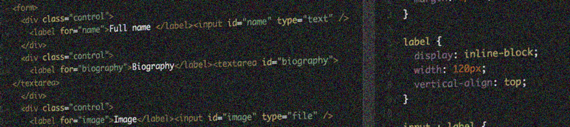

# Hiding elements correctly

Hiding elements correctly is essential when developing accessible websites: sometimes you want to show stuff to one audience, but not to another. Much is possible, but there are some pitfalls!

{.image}

There definitely are cases when some element on a page needs to be hidden from one channel or another. Here you learn how to do it - and when.

# TL;DR - Too long, didn't read

{.image}

We begin by showing how to [hide elements visually](/code-examples/hiding-elements-correctly/hiding-elements-visually-by-moving-them-off-screen){.page title="Hiding elements visually by moving them off-screen"} by moving them off-screen.

We then show how to [hide elements from screen readers](/code-examples/hiding-elements-correctly/hiding-elements-from-screen-readers-using-aria-hidden){.page title="Hiding elements from screen readers using aria-hidden"} using ARIA - and why this can be very dangerous!

Last (but not least) we show how to [hide elements from all devices](/code-examples/hiding-elements-correctly/hiding-elements-from-all-devices){.page title="Hiding elements from all devices"}.

While hiding elements can be useful, it's important to [know when to actually hide something from a specific channel](/code-examples/hiding-elements-correctly/when-to-hide-elements---and-when-to-avoid-it){.page title="When to hide elements - and when to avoid it"} - and why most of the time you're better off avoiding it.

This is followed by a short look at some regularly asked questions about possible [search engine optimisation problems](/code-examples/hiding-elements-correctly/search-engine-optimisation-concerns){.page title="Search engine optimisation concerns"} regarding hidden elements.

Finally, we raise the [question whether CSS is discriminating people with special needs](/code-examples/hiding-elements-correctly/is-css-discriminating-people-with-special-needs){.page title="Is CSS discriminating people with special needs?"}.