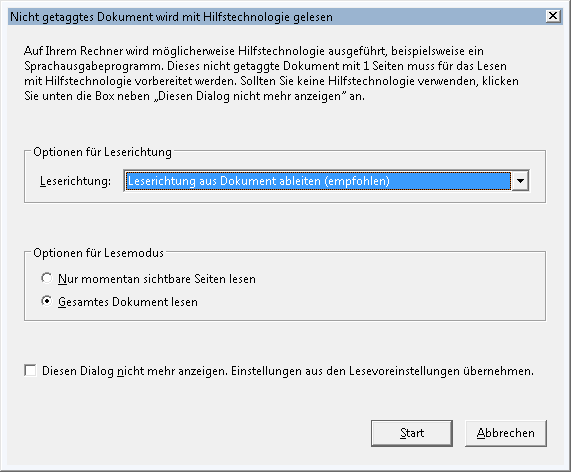

# Portable Document Format (PDF)

To find out, whether a PDF is accessible:

Open it in JAWS. When the following dialog is displayed, the PDF isn't tagged at all:

{.image}

Or use PAC's screen reader preview feature.