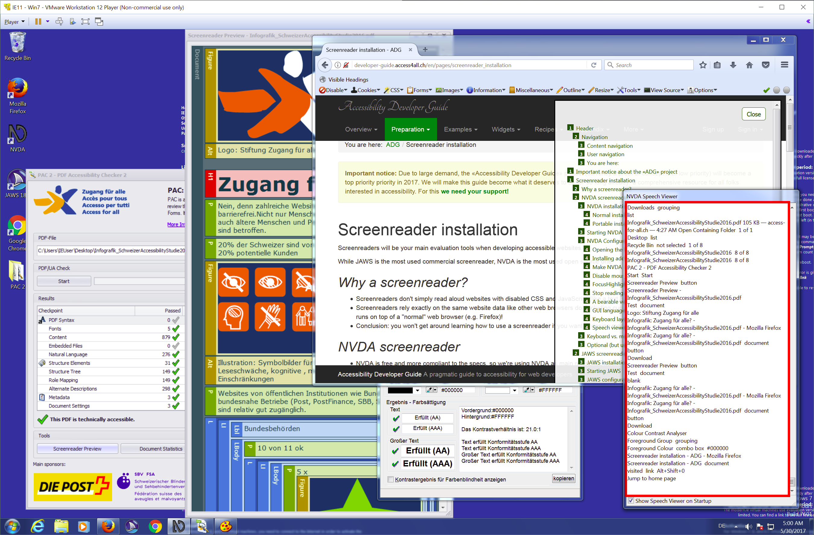

# Environment Needed For Developing Accessible Websites

For efficient and effective Accessible Web-Development and Accessibility Testing it is required to have all the relevant and useful tools at hand. This article presents step-by-step instructions for setting up a proven testing environment on a (virtual) Windows machine. 

See how to install and set up to most important **browsers**, accessibility browser **extensions**, standalone **tools** and last but not least: **screen readers**.

{.image}

Find detailed information on setting up 

  - a virtual machine, 
  - screen readers
  - browsers and 
  - valuable browser tools and extensions
  - as well as some important standalone applications