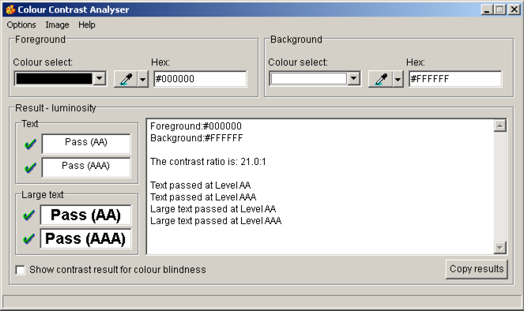

# Accessibility Testing Tools

Find the most important and relevant tools for detecting and analyzing accessibility issues on web pages. Be it native applications, browser tools and extensions or bookmarklets.

# DOM and Style Inspector

Together with live screen reader testing the probably most valuable tools for testing and analyzing accessibility are **Web Developer Tools with DOM and Style Inspector** functions provided by most of the modern web browsers. In most browsers they can be started by pressing `F12` key or by *right-clicking on a specific element* and choosing `Inspect Element (Q)` (FF) or just `Inspect` (Chrome).

# Browser Extensions

## Web Developer Toobar (Firefox)

{.image}

- The Web Developer extension adds various web developer tools to the browser: 
- Install the [Web Developer Toolbar](https://addons.mozilla.org/de/firefox/addon/web-developer/)

## WAVE Evaluation Toolbar (Chrome)

{.image}

- WAVE is best used to get very quick first impression of a the accessibility of a webpage.
- WAVE is a web accessibility evaluation tool developed by WebAIM.org. It provides visual feedback about the accessibility of your web content by injecting icons and indicators into your page.
- [Download WAVE Evaluation Tool](https://chrome.google.com/webstore/detail/wave-evaluation-tool/jbbplnpkjmmeebjpijfedlgcdilocofh) and install it
- This also exists for Firefox, but is outdated

# Bookmarklets

  - Bookmarklets are bookmarks containing JavaScript code instead of an URL
      - They are executed while surfing a website and typically analyse some stuff and display results
  - Install bookmarklets by dragging the specified link to your bookmarks toolbar
      - If you're not able to drag and drop, copy the link location, create a bookmark manually, and paste the copied code as URL
  - We suggest you add every bookmarklet to every browser, but be sure to have them at least in your main browser

## Visible Headings bookmarklet

 - Bookmark this: #{render 'visible_headings_bookmarklet_code'}
 - Special thanks go to [Hinderling Volkart](http://www.hinderlingvolkart.com/)
  - This doesn't work in IE

## Contents structured

  - This is a slightly optimised version of the [Inhalte gegliedert](http://testen.bitv-test.de/bookmarklets.html) bookmarklet
      - Our version highlights some more elements
  - Bookmark this: #{render 'contents_structured_bookmarklet_code'}

# Native Applications

## Colour Contrast Analyser CCA (Mac, Windows)

{.image}

  - The Colour Contrast Analyser (CCA) helps you determine the legibility of text and the contrast of visual elements, such as graphical controls and visual indicators.
  - Download [Colour Contrast Analyser](https://www.paciellogroup.com/resources/contrastanalyser/) and install it

## PDF Accessibility Checker (PAC)
  
{.image}

  - The freeware program PAC provides a fast way to test the accessibility of PDF files. PAC supports both experts as well as end users conducting accessibility evaluations.
      - The Matterhorn Protocol (PDF) is designed to foster adoption of PDF/UA by providing a set of 31 checkpoints and 136 failure conditions that help software developers exchange detailed information on PDF/UA conformance and create software to make it easier for document authors to create fully accessible PDF files and forms.
  - Download [PDF Accessibility Checker](http://www.access-for-all.ch/ch/pdf-werkstatt/pdf-accessibility-checker-pac/download-pac.html)

# Windows High Contrast Mode

TODO

# TotalValidator

TODO