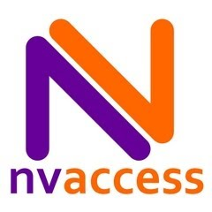

# NVDA Installation and Configuration

NVDA (Non Visual Desktop Access) is a very reliable screen reader. We're using it as main reference when developing websites.

After using it for a while, you will love NVDA as a firm but fair teacher.

{.image}

# NVDA installation

[Download NVDA](http://www.nvaccess.org/download/).

## Normal installation (requires admin rights)

- Normal installation means installing NVDA like any other application
    - This means that NVDA can automatically start during and/or after log-on, that it provides a keyboard shortcut to start/restart it, associates add-on files, etc.
    - We recommend normal over portable installation (see below)
- [Install NVDA](http://www.nvaccess.org/files/nvda/documentation/userGuide.html?#toc11)

## Portable installation (no admin rights required)

- If you don't have admin rights on your computer, NVDA offers the option to be installed as `portable`
    - NVDA's portable installation has [some restrictions](http://www.nvaccess.org/files/nvda/documentation/userGuide.html?#toc10)
- [Install NVDA](http://www.nvaccess.org/files/nvda/documentation/userGuide.html?#toc15)
- Be sure to manually create a new folder as installation location, e.g. `NVDA` on your Desktop

# Starting NVDA

- If you chose normal installation, you can start (and restart) NVDA any time by pressing the `Ctrl + Option + N`
    - If you choose portable installation, simply start NVDA using the `NVDA.exe` in its installation folder
- After clicking away the start screen, you won't see much of NVDA except a small icon in the system tray
- By the way, using `CapsLock` as a modifier key doesn't seem to work in a virtual machine (?)

# NVDA Configuration

## Opening the NVDA menu

- NVDA offers a menu with a lot of settings
- You can open it by pressing `NVDA + N`
    - By default, the `NVDA` key is the `Insert` key (see [Screen readers are keyboard shortcut monsters](/knowledge-about-developing-and-testing-accessible-websites/introduction-to-desktop-screen-reader-usage/screen-readers-are-keyboard-shortcut-monsters){.page})
- You can navigate it using the arrow keys
- For quick navigation, press the letter on you keyboard that is underlined in the intended menu item
    - For example, press `E` for `Exit`
    - In this guide, we indicate those letters by putting braces around them, like so: `(E)xit` or `Manage (a)dd-ons...`
- You can close the menu items by pressing `Esc`
- You can also open the NVDA menu by clicking on the Icon in the `System Tray`

## Installing add-ons

- If you chose normal installation, double click the downloaded file and NVDA will install it
- If you chose portable installation, TODO

## Make NVDA shut up on demand

- After launching NVDA, it will begin talking and talking whatever your current focus lies on the screen:
    - You can make it shut up for the time being by pressing the `Ctrl` key
    - Whenever you move the focus though (e.g. by moving your mouse), NVDA will begin talking again!
    - To make NVDA completely shut up:
        - You can shut it down: In the NVDA menu, select `(E)xit`
        - You can toggle speech mode on/off by pressing `NVDA + S` repeatedly → be aware that NVDA is still running and intercepting your key presses!

## Disable mouse focus

- As visually non-impaired developers, we usually want to rely on using the mouse sometimes
- To avoid NVDA an element when moving the mouse over it (which makes it brabbling like hell), we disable mouse focus like so:
    - In the NVDA menu, choose `(P)references` → `(M)ouse settings`
    - Disable `Enable mouse tracking` and press `Enter`

## FocusHighlight add-on

- This add-on indicates visually where the cursor is when browsing and interacting with NVDA
- [Download Focus Highlight add-on](http://addons.nvda-project.org/addons/focusHighlight.en.html) (stable version) and install it

## Don't display exit confirmation

- In the NVDA menu, choose `(P)references` → `(G)eneral settings`
- Disable `Sho(w) exit options when exiting NVDA` and press `Enter`

## Stop reading and reading (and reading and reading...) automatically

- NVDA by default reads everything from the position of the focus onwards (e.g. when refreshing a webpage)
- This is not what developers usually want.
- In the NVDA menu, choose `(P)references` → `(B)rowse mode`
- Disable `Automatic say all on page load` and press `Enter`
- Now NVDA stops after reading the current element.

## A bearable voice synthesizer (optional)

- The standard NVDA voice synthesizer is a bit robotic, so let's install a nicer, more natural one.
- [Download Svox Pico add-on](http://files.nvaccess.org/nvda-addons/svox-pico-2.0.nvda-addon) and install it
- In the NVDA menu, choose `(P)references` → `(S)ynthesizer`
- As synthesizer, choose `Svox pico synthesizer` and press `Enter`
- In the NVDA menu, choose `(P)references` → `(V)oice settings`, choose your desired voice, and press `Enter`
- While this voice synthesizer sounds more natural, it tends to be slower
    - It might be a good idea to think about switching back to the original voice after you have accustomed a bit to NVDA (it's faster and more accurate)
      
## GUI language

- You can choose the language of NVDA itself (the GUI, not the voice).
- In the NVDA menu, choose `(P)references` → `(G)eneral settings`
- Choose your desired language (we suggest you're using `English, en` to be able to easily follow this guide)

## Keyboard layout

- There's a `Desktop` and a `Laptop` layout. For this guide, `Laptop` is used.
- In the NVDA menu, choose `(P)references` → `(K)eyboard settings`
- Choose `laptop` as keyboard layout

## Speak typed characters, words, and command keys

- NVDA can announce every typed character, full words, and command keys
- This can be useful for spectators watching somebody using NVDA
- In the NVDA menu, choose `(P)references` → `(K)eyboard settings`
- Enable `Speak typed (c)haracters`, `Speak typed (w)ords`, and `Speak command (k)eys`

## Speech viewer shortcut

- The speech viewer displays the audio output in text form, which is very useful
- By default, it can be opened like this: in the NVDA menu, choose `(T)ools` → `(S)peech viewer`
- You can make the speech viewer open automatically on startup
  - Do so by activating the `(S)how Speech Viewer on Startup` checkbox, located at the speech viewer's bottom left
- You can add a shortcut like this:
    - In the NVDA menu, choose `(P)references` → `I(n)nput gestures`
    - Enter `speech` into `Filter by`
    - Under `Tools`, select `Toggles the NVDA Speech viewer...`
    - Click `Add`
    - Press the desired shortcut, e.g. `Ctrl + Option + V`
    - From the popping up menu, choose the entry with `all layouts`
    - Click `OK`

## Speech viewer font size

- You can zoom the font size using `Ctrl` + mouse wheel
- At the time being, font size is always set back to default on quit

# Keyboard vs. mouse

- Blind people don't use a mouse
- So you should learn #{link_to 'how to control a computer using the keyboard only', page_path('keyboard_navigation_basics')}
- Keep in mind: When NVDA is active and browsing content, it intercepts every key stroke and may alter existing functionality or add new one
- So don't be surprised when the computer sometimes behaves differently when controlling it with the keyboard while NVDA is activated

# Optional (but useful) plugins

- [Tip of the day](http://addons.nvda-project.org/addons/tipOfTheDay.en.html) shows usage tips on startup
- [No beeps speech mode](http://addons.nvda-project.org/addons/noBeepsSpeechMode.en.html) excludes "Beeps" in speech mode when toggling speech modes (`NVDA + S`)
- [Control usage assistant](http://addons.nvda-project.org/addons/controlUsageAssistant.en.html) offers help for the currently focused item when pressing `NVDA + H`
- [Audio themes](http://addons.nvda-project.org/addons/audioThemes.en.html) makes NVDA play sounds when browsing certain elements (really great idea, but feels a bit buggy at the time being: at least for non-focusable items, this doesn't work for us)