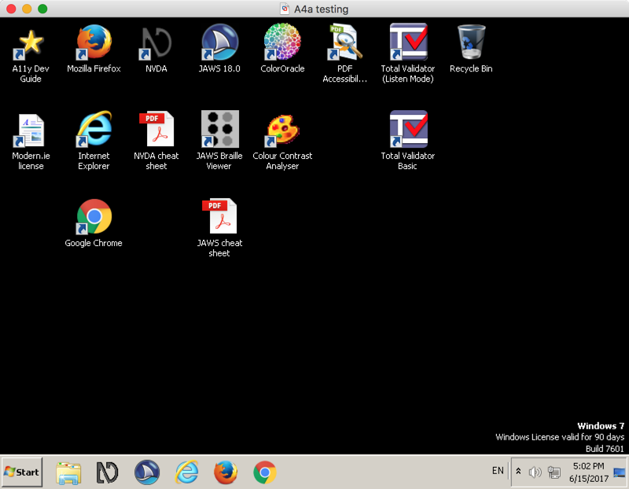

# Pre-configured virtual machine

Get your free pre-configured accessibility testing virtual machine here!

Start developing and testing accessible websites today!

{.image}

Setting up a perfect environment for developing and testing testing accessibility needs quite some effort. Luckily, we can deliver you a copy of our own pre-configured accessibility testing virtual machine (VM): up to date, ready to be used, free - and legal, of course.

The VM offers all the [Relevant Screen Readers](/environment-needed-for-developing-accessible-websites/relevant-screen-readers){.page},  [Relevant Web Browsers](/environment-needed-for-developing-accessible-websites/relevant-web-browsers){.page}, and  [Accessibility Testing Tools](/environment-needed-for-developing-accessible-websites/accessibility-testing-tools){.page} described in our [Environment Needed For Developing Accessible Websites](/environment-needed-for-developing-accessible-websites){.page} section.

Please [Get in touch with us](/about-the-accessibility-developer-guide--adg-/get-in-touch-with-us){.page} and ask for the pre-configured VM.

# Legal note

We deliver a copy of a [modern.ie Virtual Machine](https://developer.microsoft.com/en-us/microsoft-edge/tools/vms/), enriched with free to use software and proper configuration.

The modern.IE VM comes with a license that allows free usage during 90 days. After launching the VM the first time, Windows will ask for activation. **Note:** if you create a snapshot before activation, you can rollback again and use the VM basically without any limit.