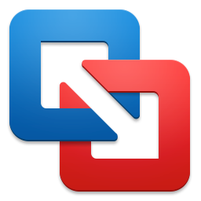

# Virtual testing machine with VMware Fusion (Mac)

Running a nicely set up VM on Macs is not only highly recommended for screen reader testing but also to run programs such as the PDF Accessibility Checker PAC.

# Install VMWare Fusion

{.image}

  - Unzip the VM using [The Unarchiver](http://wakaba.c3.cx/s/apps/unarchiver.html), as the built-in unzip version isn't capable of zip64 files
  - Download [VMWare Fusion (Mac)](http://www.vmware.com/ch/products/fusion) or [VMWare Workstation Player (Windows, Linux)](http://www.vmware.com/de/products/player/), install and launch it
      - There are alternatives to VMWare, but VMWare has proven to us to be the most seamless and performing option
  - Choose `File` → `Import` and select the `*.ovf` file in the extracted folder
  - Take a [snapshot](TODO Link!) (`Command-Shift-S`) so you can easily go back to the initial state of the VM if something breaks later
  - If you have a retina display, under `Virtual Machine` → `Settings`, go to `Display` and deselect `Use full resolution for Retina display` (otherwise your eyes will begin to hurt)
  - Start the VM
  - To increase performance, in the VM, go to `Control Panel` → `System` → `Advanced Tab` → `Performance Settings`, then click on `Adjust for best performance` and `OK`
  - To increase operability between VM and OSX, install VMware Tools: `Virtual Cachine` → `VMware Tools Installation`
  - To be able to connect to the internet, first shutdown the VM, then add a network adapter by clicking on `Add Device...` and choosing `Network Adapter`
      - Use option `Share with my Mac`
      - You may have to start and restart the VM to make it work

# Set up VMWare for convienent screen reader testing

## Disable left Windows key

  - The left Command key translates to the left Windows key
  - Pressing `Cmd-Tab` may interfere with the left Windows key, so you can disable it for the virtual machine:
      - `VMware Fusion` → `Preferences` → `Keyboard & Mouse` → `Mac Host Shortcuts`
      - Then under `For Windows key, use` select `Right Command key`

## Change behavior of function keys

  - NVDA makes use of the function keys (F1-F12) a lot
  - By default, you have to press the `Fn` key in addition to the function key to enable it
  - As NVDA shortcuts are quite tricky already, we suggest that you [change the behaviour of function keys](https://support.apple.com/en-us/HT204436)

### Emulating the Insert key

  - Screenreaders rely heavily on the Insert key which isn't available on Macs, so you will have to emulate it

#### Option 1: VMware Fusion Keyboard shortcut

  - VMWare Fusion offers a feature to re-map keys
  - Go to `Preferences` → `Keyboard & Mouse` → `Key Mappings`
  - Here, you can map a key combination to `Insert`, but sadly not a modifier key alone
      - For example, you could map `Option-X`
      - Now whenever you have to press an NVDA keyboard shortcut, instead of `Insert` press `Option-X` (for example, instead of `Insert-F7`, press `Option-X-F7`)
      - This works for many cases, but some keyboard shortcuts of screenreaders are so complex that this won't work anymore, so we don't recommend this

#### Option 2: Karabiner (OSX)

  - Karabiner translates any given key to any other (in OSX)
  - Download [Karabiner](https://github.com/tekezo/Karabiner), install and launch it
  - Under `Misc & Uninstall` click on `Open private.xml`, which will open a Finder window
  - Replace `private.xml` with (#{link_to 'private.xml', '/karabiner/private.xml'})
  - Reload the configuration by clicking `Change Key` and then `Reload XML` (you should see an entry `Command-right to Insert (VMWare Fusion)` in the list, make sure it is active!)
  - Now you can use your right Cmd key as Insert key (in VMWare Fusion only)
  - Feel free to choose some other key instead of right Cmd, see [private.xml Reference Manual](https://pqrs.org/osx/karabiner/xml.html.en)

#### Option 3: SharpKeys (Win)

  - SharpKeys translates any given key to any other (in the virtual machine itself)
  - Download [SharpKeys](http://sharpkeys.codeplex.com/), install and launch it
  - Click `Add`, then map any key you like (e.g. the right `Windows` key `E0_5C`) to `Insert` key (`E0_52`)
  - Click `OK` and `Write to Registry`

#### Option 4: External USB num lock keyboard

  - You can also buy an [USB num lock keyboard](http://lmgtfy.com/?q=USB+num+lock+keyboard)

### Prevent opening the Start menu when pressing Cmd-Tab

  - Power users are used to use `Cmd-Tab` to switch between opened applications in OSX
  - Sadly, this triggers the Start menu within the running Windows virtual machine
  - Prevent this by going to `Preferences` → `Keyboard & Mouse` → `Mac Host Shortcuts`, then under `For Windows key, use` select `Right Command Key`.

## Integration

  - We think it's easiest to have VMWare running in `Single Window` mode (default)
      - Use `Cmd-Tab` to switch between Mac apps
      - Use `Alt-Tab` to switch between Windows apps (when VMWare is active)
  - If you want all Windows apps to be accessible from the Dock, the "Unity" mode is pretty cool, too
      - Even the Windows' task bar icons will appear in the Mac's menu bar!
  - Whichever mode you prefer, simply start new Windows apps through the VMWare icon in the menu bar

### VMWare preventing OSX from waking up correctly?

  - There's a [known problem](https://communities.vmware.com/thread/467919?start=0&tstart=0) of VMWare Fusion that can prevent OSX from re-enabling keyboard and mouse after wake up from sleep
      - If nothing else fixes the problem, [use SleepWatcher to shutdown the VM automatically before going to sleep](https://communities.vmware.com/message/2489757#2489757)