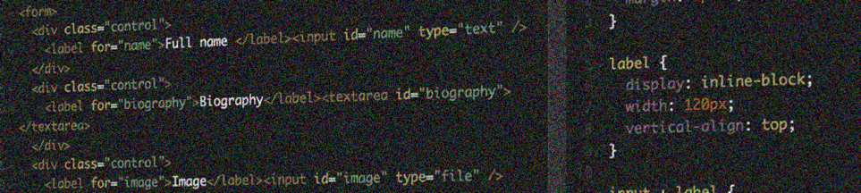

# Forms, validations, and error messages

{.image}

When not simply reading websites, users are interacting with them. The most common use case is entering data and selecting options in a form.

# TL;DR - Too long, didn't read

First things first: you need to [learn how to handle form elements](/examples/forms/how-to-browse-forms){.page title="How to browse forms"} - using screen readers, keyboard-only, and other tools!

We then prove that [HTML delivers you everything you need](/examples/forms/general-forms-example){.page title="General forms example"} to create basic accessible forms:

- A pretty exhaustive list of controls like text input, file upload, radio buttons, checkboxes, etc.
- Labels to describe the inputs
- Fieldsets to group inputs and legends to describe them

This is followed by a [demonstration about what typically can go wrong](/examples/forms/bad-forms-example){.page title="Bad forms example"} when developers aren't mindful and forget about proper semantics.

Further on, we show [how fieldsets and legends should be used](/examples/forms/grouping-form-inputs-using-fieldset-and-legend){.page title="Grouping form inputs using fieldset and legend"} and [how to fake them - if necessary - using ARIA](/examples/forms/faking-fieldset-legend-using-aria){.page title="Faking fieldset / legend using ARIA"}. Sometimes it's also desirable to [mix headings](/examples/forms/grouping-form-inputs-using-headings){.page title="Grouping form inputs using headings"} and [other non-interactive content](/examples/forms/non-interactive-content-in-forms){.page title="Placing non-interactive content into forms"} into forms.

{.image}

User input validation is an important topic: we show [how to display validation errors and associate them to inputs](/examples/forms/validations-and-error-messages){.page title="Validations and error messages"}, [how to mark inputs as "required"](/examples/forms/marking-inputs-as-required-using-asterisks-){.page title="Marking inputs as required using asterisks (*)"}, and [how to use HTML5 client-side validations](/examples/forms/html5-client-side-validations){.page title="HTML5 client-side validations"}.

We agree that sometimes it's desirable to [mix form elements into tables](/examples/forms/forms-in-tables){.page title="Forms in tables"}.

Think you need a fancy widget? Read this first, we show [how to transform basic form controls into fancy looking (and feeling) custom controls](/examples/forms/advanced-visual-stylings-of-basic-form-controls){.page title="Advanced visual stylings of basic form controls"} - all without using JavaScript!

Talking about JavaScript: sometimes it's necessary that [form controls adapt to user input](/examples/forms/changing-form-fields-dynamically-based-on-user-input){.page title="Changing form fields dynamically based on user input"}.

Finally, the [FAQ](/examples/forms/faq-frequently-asked-questions){.page title="FAQ - frequently asked questions"} gives answers to many more everyday questions.