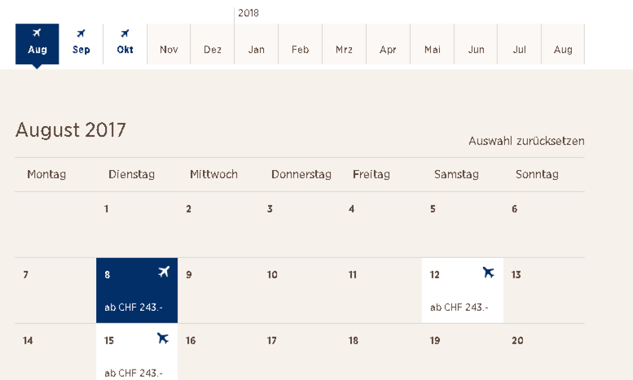

# Advanced visual stylings of basic form controls

**TODO**

Aufzeigen, dass man einfache Form Controls sehr sinnvoll einsetzen kann auch für anspruchsvollere Aufgaben.

Etwa Radiobuttons für Datumsanwahl:

Man sollte sich aber immer fragen, ob es sinnvoll ist, da es auch verwirren kann:

