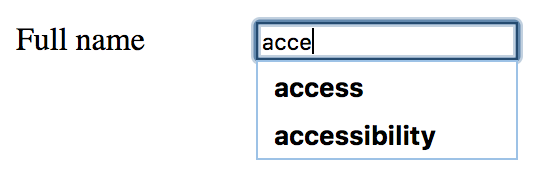
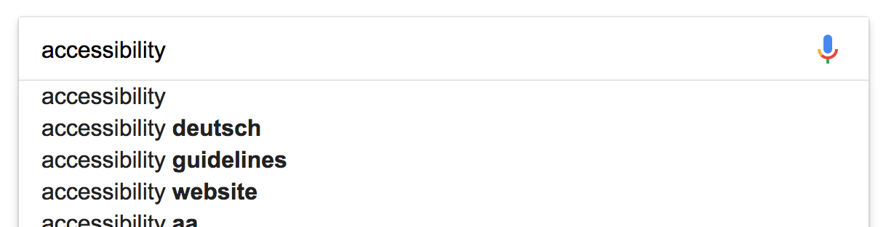

# General good form example

**Forms are widely used to accept user input, be it for transferring it to the server or to act upon it locally using some JavaScript. HTML provides for accessibility, so cleanly laid out and marked up form controls are already fully accessible all by themselves. Still, screen readers may sometimes announce specific elements a bit irritatingly.**

[[toc]]

The following example contains all basic HTML form controls:

- Single line text input: `<input type="text">` (with `maxlength`, `readonly`, and `disabled` variants).
- Multi line text input: `<textarea>`.
- File upload: `<input type="file">`.
- Radio buttons: `<input type="radio">`.
- Multiple checkboxes: `<input type="checkbox">`.
- Single select (combobox): `<select>`.
- Multi select (list): `<select multiple>`.
- Single select with grouping: `<select>` with `<optgroup>`.
- Multi select with grouping: `<select multiple>` with `<optgroup>`.
- Single checkbox: `<input type="checkbox">`.
- Submit button: `<button type="submit">` (with a `disabled` variant).

Each form control has a corresponding `<label>` element that is connected to it using the `for` attribute (pointing to the control's ID). This allows screen readers to announce the controls correctly.

Each group of radio buttons and checkboxes has a surrounding `<fieldset>`/`<legend>` structure: in addition to the control's `<label>`, screen readers also announce the `<legend>` of the surrounding `<fieldset>`. The usage of this structure is not limited to radio buttons and checkboxes: all kinds of related form controls can be grouped like this.

As the controls are surrounded with a `<form>` tag, the form can be submitted without hitting the submit button: simply press the `Enter` key while you are focusing a control (except multi line text input and file upload).

In the example, all attributes irrelevant for demonstration purposes (for example `name`) are omitted.

[Example](_examples/generally-good-form)

Navigate the example using tap or `Tab` and notice how the screen reader announces all relevant information about the current form control.

## Irritating screen reader behaviours

In general, screen readers handle form controls pretty uniformly: when placing focus upon one, its label is announced, its type, its grouping (if available) and information about its state and attributes.

But there are some behaviours that may be surprising (if not confusing), and some behaviours simply are buggy. We are mainly talking about NVDA here, but JAWS has similar peculiarities.

### Announcement of controls' attributes

HTML offers a lot of attributes to customise the behaviour of form controls. These attributes usually are announced by screen readers.

The most known attribute to customise a control is `<input>`'s `type`. For example, if its value is `text`, NVDA will announce `edit`; but if its value is `checkbox`, NVDA will announce `checkbox`. This way the user easily knows how to deal with the control: whether hitting the `Space` key will result in a blank character, or whether it will check/uncheck an option.

Another such attribute is `readonly`: it makes a form control immutable by the user, and NVDA dutifully announces such controls as "read only".

#### Non-intuitive announcements

Some other attributes are not announced equally intuitive. For example, plain text inputs are announced as "has autocomplete" by NVDA. This is because HTML offers an [`autocomplete` attribute for single line text inputs](https://www.w3schools.com/tags/att_input_autocomplete.asp), which by default is set to `true`.

This option tells the browser to remember data previously input by the user and to offer those in a dropdown for re-use.

This may be counter-intuitive, because it does not have anything to do with an autosuggest feature like it is offered for example by [Google Search](https://www.google.com):

If you are really curious and want to learn more about this, skip ahead and read [Autosuggest widget (or: autocomplete, lookahead, typeahead)](/examples/widgets/autosuggest).

#### Missing announcements

Yet other attributes surprisingly seem not to be announced at all.

For example, the `<input type="text">`'s `maxlength` option is not announced by both NVDA and JAWS. Even if users reach this limit while inputting, they are given no clue. For more info, see: [No announcement of maxlength (GitHub.com)](https://github.com/nvaccess/nvda/issues/7910).

Also, `<select>`'s `multiple` option currently is not announced by NVDA, making it really hard for its users to deal with this special control. JAWS announces this as "multi select". For more info, see: [For select lists, why is the "multiple" option not announced? (GitHub.com)](https://github.com/nvaccess/nvda/issues/7579).

If you test your forms and stumble over such missing (or irritating) announcements, you should add information about it in plain text to your form controls. For example, when using `maxlength="20"`, you can add this information to the control's label, like "Full name (max. 20 characters)".

### Missing labels of upload fields (FF)

For `<input type="file">`, browsers draw their own "Choose file" (or similar) button. Although those controls can (and should) have their proper `<label>`, in Firefox, NVDA does not announce it.

This seems to be a bug in Firefox, see: [Input type="file" is only read as "browse button" in firefox (GitHub.com)](https://github.com/nvaccess/nvda/issues/5326).

### Checkboxes do not trigger focus mode

You may have noticed that NVDA does not activate focus mode when focusing a checkbox using the `Tab` key. As each and every other form control activates focus mode upon focus, this may feel irritating (if you haven't done this yet, go back and read [Screen readers' browse and focus modes](/knowledge/screen-readers/desktop/browse-focus-modes)).

More information here: [Why do radio buttons trigger focus mode, but checkboxes do not? (GitHub.com)](https://github.com/nvaccess/nvda/issues/7578).

### Disabled controls are not focusable

There are two `disabled` form controls in our example: the coupon input and the cancel button. You may have noticed that both of them are not focusable. This in fact is not a screen reader peculiarity, but how browsers handle focusability.

Technically speaking, disabling controls is a fully valid standard technique. But for desktop screen reader users, this can lead to confusion, as they will miss these controls completely when navigating the form using the `Tab` key.

#### Disabling buttons

For example, some websites disable the submit button because of incomplete or invalid user input. In this situation, screen reader users probably will not recognise the end of the form (which is usually marked by the submit button). So they will tend to search for additional form controls too far on the page.

Generally speaking, you should avoid disabling buttons.

#### Disabling inputs

Also, be aware that disabling an input not only makes it non-focusable - it also prevents its data from being sent after submit.

Generally speaking, disabling inputs is seldom what you want. You should use `readonly` instead, which is both focusable and sends the data after submit.

### Avoiding labels that surround inputs

As already pointed out, in our example, we have one separated `<label>` for each form control and associate those pairs using the `for` attribute.

But HTML also the `<label>` to surround the form control, removing the need for a `for` attribute. But this approach can lead to problems in some situations, so we do not recommend to do it (if you are really curious and want to learn more about this, skip ahead and read [Placing non-interactive content between form controls](/examples/forms/non-interactive-content)).

## Conclusion

All in all, basic forms are very accessible by themselves.

However, although basic forms are a longstanding and fundamental part of the HTML standard, in some situations, screen readers (both mobile and desktop) behave a bit irritating, if not buggy (if you haven't done this yet, go back and read [How screen readers work - and why they seem so buggy](/knowledge/screen-readers/so-buggy)).

Here we presented some of the possible irritations we know and how to avoid them. But there may be more, especially in complex forms. This can make it hard for developers testing their solution for accessibility to decide whether their solution is "good enough", or whether they manually need to provide additional optimisations.

Generally speaking: if your forms are coded according to long established HTML standards, you should be fine most of the time. Still, it can be meaningful (or even essential) in some situations to add a little more guidance, especially for screen reader users (if you are really curious and want to learn more about this, skip ahead and read [Placing non-interactive content between form controls](/examples/forms/non-interactive-content)).
