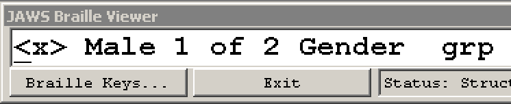
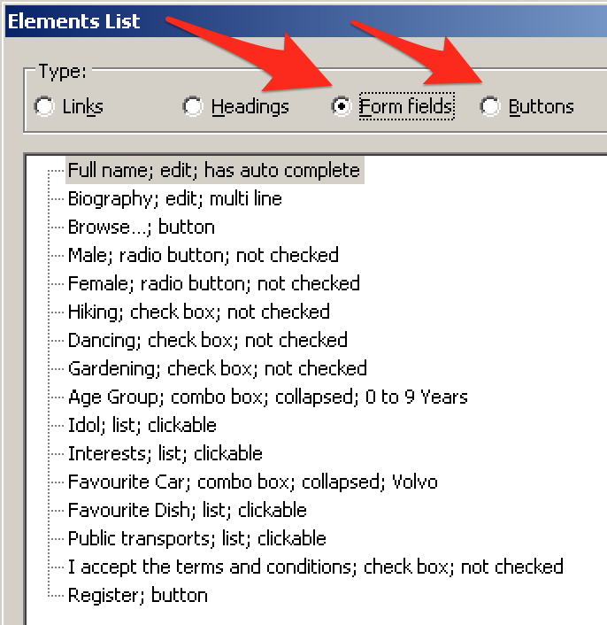
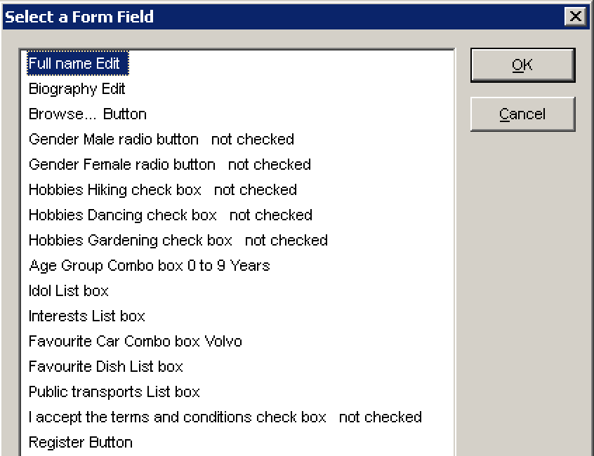

# How to handle forms

**Forms consist of many interactive elements. To work through and understand the examples in this chapter, besides knowing keyboard only usage, it is good to have a screen reader at hand and know how to handle it. In addition to this, there are some tools and bookmarklets that can be a huge help in your development workflow.**

[[toc]]

## Keyboard only handling

Forms offer a lot of keyboard interactivity, so please check out thoroughly [How to browse websites using a keyboard only](/knowledge/keyboard-only/browsing-websites).

## Screen reader handling

For screen reader users, forms offer a lot of special functionalities. Here follows a quick nomination of the most important features. Besides this, check out:

- [How to read websites using a desktop screen reader](/knowledge/screen-readers/desktop/reading-websites)
- [How to interact with websites using a desktop screen reader](/knowledge/screen-readers/desktop/interacting-with-websites)

### Quick navigation

- `Tab`: jump to next focusable element
- `F`: jump to next form element
- `B`: jump to next button
- `X`: jump to next checkbox
- `C`: jump to next combobox
- `R`: jump to next radio button

You can add `Shift` to most shortcuts to reverse direction. For example press `Shift + F` to jump to the previous form element.

### Interaction with form elements

- `Enter` (or `Esc`): enter (or exit) focus mode (a distinctive **beep** sound is played).
    - Only available when focusing an interactive element.
    - In NVDA, `NVDA + Space` is an alternative way of toggling interaction modes (regardless where the cursor is at the moment).
- `Space`: toggle checkbox and expand/collapse combobox.
- `Enter`: activate button (or submit form when focusing certain form elements).
- `Up` / `Down` (and sometimes `Left` / `Right`).
    - Select radio button value.
    - Select element in combobox.

#### JAWS braille viewer

In JAWS' braille viewer, when focusing certain form fields, information about them is displayed like this:

- In text inputs and text areas, `_` is indicating the text cursor.
- In radio buttons and checkboxes, `<x>` is indicating checked and `< >` is indicating unchecked status.
- In radio buttons, the number of options is like `1 of 2`.

In addition to this, grouped elements are indicated with their legend like `Hobbies grp`.

### Display form outline

As an alternative to navigating through the form elements directly on the page, screen readers offer a form outline view.

In the upcoming text, we are referring to the keys `NVDA` and `JAWS`. If you do not know about them, see [The Insert Modifier Key](/knowledge/screen-readers/desktop/insert-modifier-key).

#### Elements List (NVDA)

NVDA's "Elements List" displays a page's form outline. To open it:

- First make sure you are in browse mode.
    - If unclear to you, see [Screen readers' browse and focus modes](/knowledge/screen-readers/desktop/browse-focus-modes).
- Press `Alt + F` to select the "Form fields" area.
- Press `Alt + B` to select the "Buttons" area.

#### Select a Form Field (JAWS)

JAWS' "Select a Form Field" displays a page's form outline.

To open it, press `JAWS + F5`.

## Useful helper tools

### WAVE toolbar

WAVE toolbar checks for some well-known problems regarding forms, for example:

- It makes sure that every form element has an associated label.
- It warns about improper form structures (like a `<fieldset>` without `<legend>`).

For more details, see [WAVE toolbar](/setup/browsers/chrome/wave-toolbar).

### Your mouse

By clicking on an input's label, you can verify whether the two are associated: if everything is done properly, after clicking, the focus is set to the form field.

## Useful bookmarklets

### Contents Structured

This conveys the tag names of a lot of HTML elements, including form elements. It allows fast visual examination of wrong (or missing) form structures.

For more details, see [Contents Structured](/setup/browsers/bookmarklets/contents-structured).

### HTML_CodeSniffer

Similar to WAVE toolbar, HTML_CodeSniffer checks for some additional well-known problems regarding forms, for example:

- Missing `<submit>` button.

For more details, see [HTML_CodeSniffer](/setup/browsers/bookmarklets/html-codesniffer).
