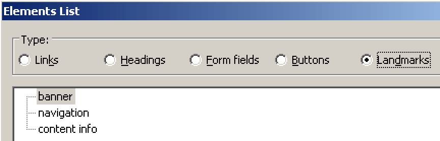
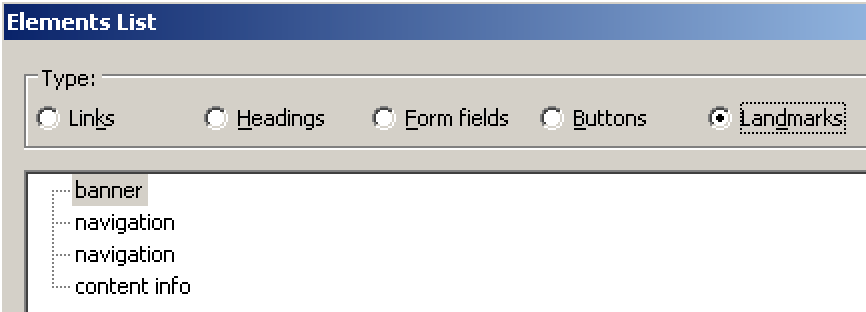
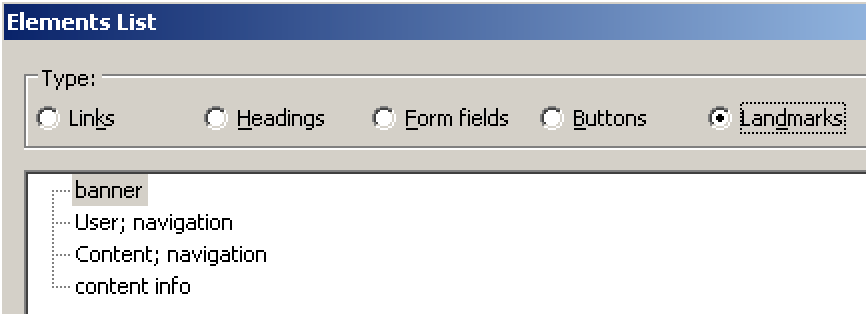
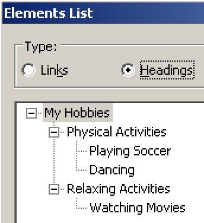
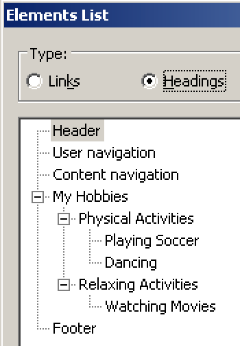
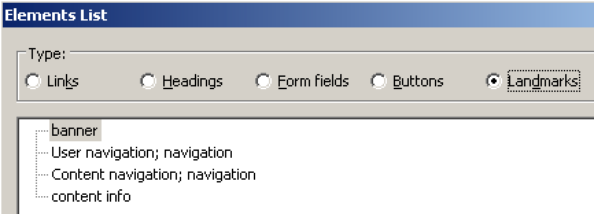

# Alternative techniques for labelling page regions

**Although headings are the most widely known technique to label page regions (like header, navigation, etc.), there exist other ways to label content in HTML. In our opinion though, headings are both the most expressive and simple technique. But let's examine the situation a bit deeper.**

[[toc]]

## Short summary

Besides traditional headings, there exists at least one other way to label regions: a combination of HTML 5 structural elements, labelled using ARIA.

In general, the use of structural elements can be fully recommended. But they are no replacement of equal value for a headings outline.

So you should always provide a proper headings outline which covers all regions on a page.

## Exhaustive explanation

### Using HTML 5 structural elements

Since HTML 5 there are some new containers that provide semantical context:

- `<header>` is meant to contain header info.
    - For example a page's logo, slogan, etc.
- `<main>` is meant to contain the main content of a page.
    - For example, on a website with cooking recipes, a page showing a single recipe would contain exactly that recipe in the `<main>` container (but not any additional page areas like header, navigation, or footer).
- `<footer>` is meant to contain footer info.
    - For example links to a page's disclaimer, copyright info, etc.
- There are a few more of those containers, like `<article>` or `<aside>`, but let's not bother about them right now.

In screen reader talk, these elements usually are called landmarks. Theoretically speaking, landmarks are a valid alternative to traditional headings when it comes to labelling page regions, as screen readers can convey them to the user.

For example, after loading a page, JAWS automatically announces how many regions there are available. And while browsing the page, entering and leaving a landmark is automatically announced, too.

[Example](_examples/page-with-html5-structural-elements)

In addition to this, many screen readers offer special features for displaying structural elements:

Even navigation between them while reading a document is easily possible:

- In NVDA, press `D`.
- In JAWS, press `R`.

By the way, you may have noticed already that screen readers have their own landmarks jargon: for example `<header>` elements are announced as "banner", and `<footer>` elements as "content info".

### Labelling regions using ARIA

The more complex a website is, the more regions it probably has. So if you think of a website with both a user navigation (with sign up, login, etc.) and a content navigation (both marked up as `<nav>`), then those regions need an explicit label. Otherwise, screen reader users cannot distinguish between the two in the landmarks outline.

For labelling such a region, you can use ARIA labels.

[Example](_examples/page-with-html5-structural-elements-labelled-with-aria)

Screen readers now can display the given label in their landmarks outline.

### The downsides

In current screen readers, landmarks do not add anything to the traditional heading outlines: they look identical regardless whether there are landmarks available on the page or not.

In the example above, when using a screen reader's document outline, it is impossible to navigate to any of those additional regions, as they simply do not offer any headings. So users would have to switch between heading navigation and landmarks navigation (in case they even know about their existence), puzzling the existing information together somehow and trying to make sense of them. While for basic websites this may seem acceptable, it can become extremely frustrating (if not impossible or even misleading) in more complex ones.

Another annoyance is that not all screen readers announce these elements consistently: for example, NVDA surprisingly does not announce `<main>`, neither while browsing the page nor in its landmarks outline.

### Verdict: use plain old heading outlines

Using the document outline traditionally is the preferred navigation method by most screen reader users. So we highly suggest to always use traditional headings everywhere on your website, as seen here: [Adding visually hidden headings to complete a page's outline](/examples/headings/visually-hidden-headings).

Besides that, using ARIA to enhance semantics is bad practice anyway, see [Bad ARIA practices](/knowledge/aria/bad-practices).

#### Even better with landmarks

Having HTML 5 structural elements on the page is always a good thing, too. So a combination of both headings and landmarks is perfect:

[Example](_examples/page-with-html5-structural-elements-and-visually-hidden-headings)

By following this approach, screen reader users can use both heading navigation and landmarks navigation according to their preferences.

#### Description using ARIA (optional)

Sadly though, this leads to another case of non-unique landmarks.

To fix the problem, you could describe them with their respective headings using ARIA.

[Example](_examples/page-with-html5-structural-elements-labelled-with-aria-and-visually-hidden-headings)

This does not deliver a much better experience to screen reader users though. It may even feel a bit redundant when reading the page (as both the ARIA label and the referenced heading are announced individually, although they are the same thing).

And as screen reader users will rarely fall back on landmarks navigation when heading navigation is available, you can safely ignore this step.