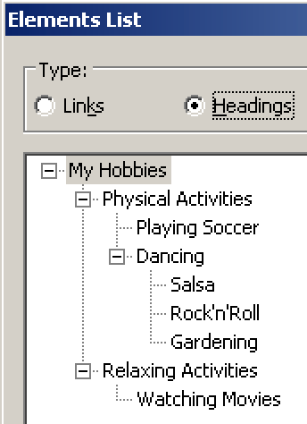
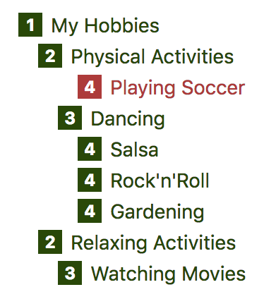

# General bad headings example

**To be meaningful, heading outlines must be coherent on both a technical and textual level. While headings often are omitted completely by naive web developers, existing heading outlines can suffer of various accessibility problems on both a syntactical and a semantical level.**

[[toc]]

This heading outline in the following example has three problems.

[Example](_examples/generally-bad-headings)

On the visual level, the problems are hard to spot. So let's take a closer look at the document outline.

## Syntactical vs. semantical problems

Most syntactical problems can be evaluated automatically: it's no problem for a computer to make sure that HTML code is nested properly.

Semantical problems, however, are determined by the contents of a page (text, images, etc.), and as such must be examined manually by a human who has certain knowledge about the presented content.

## Skipped heading level

The first problem we want to point out is that the heading "Playing Soccer" is on level 4, although its predecedent heading is on level 2. Alas, one heading level is skipped, which is obviously wrong, and will lead to confusion in many screen readers.

This problem is a syntactical one, and as such is easy to spot using automated test tools.

By the way, while NVDA does not propagate this problem to the user, the bookmarklet [h123](/setup/browsers/bookmarklets/h123) does so by marking it visually:

## Wrong nesting

The second problem is that "Gardening" is not a "Dancing" style, although the heading outline proposes this.

This problem is a semantical one, and as such can only be detected by a human examining the contents. First of all, one has to know what "Gardening" means, and based on this knowledge, one can conclude that this is not a dancing style (so it shouldn't be nested below "Dancing"). Furthermore, to nest it correctly, one needs to decide:

- Whether it belongs to "Physical Activities" as a heading level 3.
- Or whether it makes more sense to put it directly under "My Hobbies" as a heading level 2.
- Or whether it does not belong to the listed hobbies at all, and as such would be a heading level 1.

A computer probably will never be able to do that.

## Improper markup

The third problem is that "Meditate" is not marked up as a heading, although it visually clearly resembles one. Instead, it is styled only to resemble a heading using as a `<strong>` tag (instead of an `<h#>`).

Again, this problem is a semantical one, and needs manual inspection. To examine it, one has to conclude that a very short paragraph that is displayed in **bold** (and is placed above a following paragraph) might be meant as a heading, but has been marked up improperly. Although a computer can make an assumption about this, it will never be a 100% certain.

To find out more about this, see [Semantics and their importance for accessibility](/knowledge/semantics).

## Conclusion

While creating a heading outline using HTML is pretty straightforward, a lot can go wrong when HTML coders are not careful about using the correct tags. But also content authors need to be aware of selecting the right styles in the [WYSIWYG](https://en.wikipedia.org/wiki/WYSIWYG) editor of their [CMS](https://en.wikipedia.org/wiki/Content_management_system).

Some of the risks can be limited by automated mechanisms, e.g. by a validation that is triggered upon save and enforces the syntactically correct nesting of heading tags. But besides that, thorough manual counter-checking and proof-reading of contents needs to be a high priority item on any redactors' guidelines.
