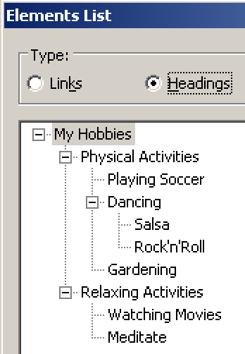
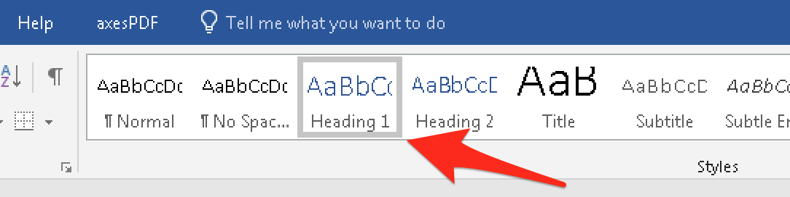

# General good headings example

**Structuring content with headings is always a good thing: no published book containing structured text could ever live without it. Headings allow to skim through the book, and the table of contents (TOC) of a book is based on them. On websites, headings work the exact same way as they do on print documents.**

[[toc]]

Headings are marked up in HTML using `<h1>` to `<h6>`. You knew that, didn't you?

The following example contains a very basic headings outline. It may look familiar to you from "normal" print documents (like PDF) and books.

[Example](_examples/generally-good-headings)

On a visual level, the headings' prominent visual attributes (for example font size, weight, sometimes colours, etc.) allow visual users to know when a new chapter or sub chapter starts or ends, or to skim through the pages of a book looking for a specific chapter.

On a semantical level, headings also announce to screen reader users when a new chapter or sub chapter starts or ends. They also allow them to jump from one heading to another quickly. By displaying the full headings outline in the form of a table of contents, screen reader users can get an idea about the page's content very quickly.

By the way, if you do not know about semantics, go back and read [Semantics and their importance for accessibility](/knowledge/semantics).

## Hey, this is like in Word!

HTML headings can be compared closely to heading styles in text processors like Word.

If they are properly used, they allow the automatic generation of stuff like a TOC. And a TOC in a print document serves the exact same purpose like the document outline on a webpage.