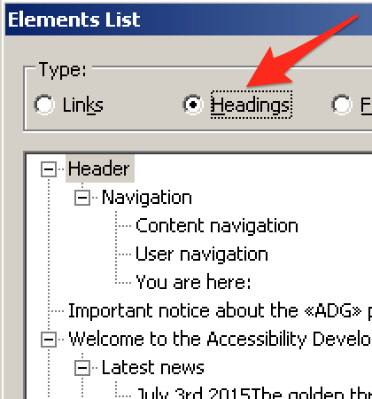
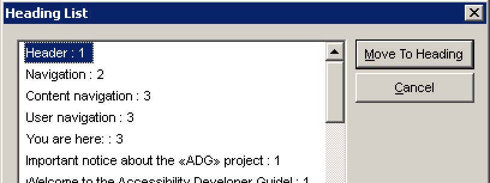

# How to handle headings

# Keyboard only handling

For keyboard only users, headings don't offer any special functionality. So there's nothing to say here. Still, you may want to check out [How to browse websites using keyboard-only](/knowledge/keyboard-only/browsing-websites){.page}.

# Screen reader handling

For screen reader users, headings offer a lot of special functionalities. Here follows a quick nomination of the most important features. Besides this, check out [How to read websites using a desktop screen reader](/knowledge/desktop-screen-readers/reading-websites){.page}.

## Quick navigation

- `H`: jump to next heading
- `1` (up to `6`): jump to next heading on level 1 (up to 6)

You can add `Shift` to most shortcuts to reverse direction. For example press `Shift + H` to jump to the previous heading.

## Display headings outline

As an alternative to navigating through the headings directly on the page, screen readers offer a heading outline view. It resembles the table of contents of a traditional book.

In the upcoming text, we are referring to the keys `NVDA` and `JAWS`. If you don't know about them, see [Screen readers are keyboard shortcut monsters](/knowledge/desktop-screen-readers/shortcut-monsters){.page}.

### Elements List (NVDA)

{.image}

NVDA's "Elements List" displays a page's heading outline in a tree view. To open it:

- First make sure you are in browse mode.
    - If unclear to you, see [Screen reader interaction modes](/knowledge/desktop-screen-readers/interaction-modes){.page}.
- Press `Alt + H` to select the "Headings" area.

Among other things, this dialog offers filter options.

### Heading List (JAWS)

{.image}

JAWS' "Heading List" displays a page's heading outline in a list view.

To open it, press `JAWS + F6`.

Among other things, this dialog offers sort and filter options.

# Useful tools

## WAVE toolbar

WAVE toolbar checks for some well-known problems regarding heading outlines, for example:

- It makes sure there is at least one first level heading `<h1>`.
- It makes sure there are no skipped levels.
- It tries to detect elements that should be headings, but aren't marked up like headings (like a short paragraph written in bold).

For more details, see [WAVE toolbar](/setup/browsers/chrome/wave-toolbar){.page}.

# Useful Bookmarklets

## h123

This is an efficient way to display and debug the correctness of the current webpage's heading outline, without the need to fire up a screen reader.

For more details, see [h123](/setup/browsers/bookmarklets/h123){.page}.

## Contents Structured

This conveys the tag names of a lot of HTML elements, including headings. It allows for fast visual detection of wrong (or missing) headings.

For more details, see [Contents Structured](/setup/browsers/bookmarklets/contents-structured){.page}.