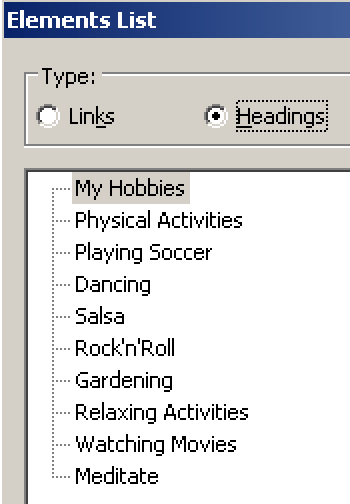
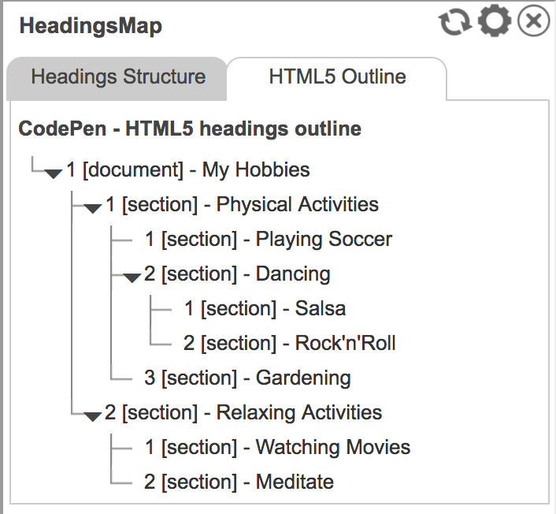
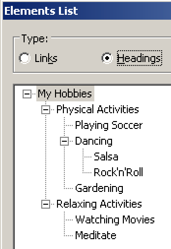

# HTML 5's headings outline algorithm

**The idea behind HTML 5's heading algorithm is great: it promises to offer valid and highly accessible heading outlines that can be much easier to implement than traditional ones. Sadly, it was never really picked up by any browser or screen reader, and the HTML 5.2 draft advises against using it any further.**

[[toc]]

## Short summary

No single relevant assistive software supports the HTML 5 outline algorithm, and as such the current [HTML 5.2 draft: Creating an outline](https://www.w3.org/TR/html52/sections.html#creating-an-outline)) advises not to use it and to rely upon traditional headings (`<h1>` to `<h6>`) instead.

If you happen to have implemented such an HTML 5 outline already, there are ways to optimise it using ARIA, so assistive technologies can use them.

## Exhaustive explanation

The HTML 5's heading outline algorithm allows to create and maintain valid heading outlines very easily by using the HTML 5 structural elements like `<main>`, `<article>` and `<aside>`.

In traditional HTML, you have to choose the correct heading level rigorously depending on the current context. In HTML 5, using structural elements you can start with whatever heading level you want. This makes including external content very easy, as you do not have to worry about the content's heading levels anymore (speaking about it: another way to include external content is by using an iframe, see [External Content in iFrames](/examples/headings/iframes)).

Sadly though, it is not possible to use HTML 5 heading outlines for accessible websites, as we will explain further on.

### Fact: HTML 5 outlines are not accessible

The HTML 5 outline algorithm sadly was never implemented by any relevant assistive software. Because of that, meanwhile even the W3C advises against using the HTML 5 document outline in its HTML 5.2 draft: [Computer says NO to HTML 5 document outline (html5Doctor.com)](http://html5doctor.com/computer-says-no-to-html5-document-outline/).

The following example shows the technically correct usage of the HTML 5 outline algorithm.

[Example](_examples/html-5-headings-outline)

On a visual level, browsers apply stylings that resemble correct indentation of nested heading levels.

Checked out with a screen reader though reveal that all headings semantically are on the very first level. What a bummer!

### How it ought to behave

If you want to see how the same example ought to be interpreted by assistive software, check out the browser extension [HeadingsMap (Chrome)](https://chrome.google.com/webstore/detail/headingsmap/flbjommegcjonpdmenkdiocclhjacmbi) or [HeadingsMap (Firefox)](https://addons.mozilla.org/en-US/firefox/addon/headingsmap/). It has an experimental feature for displaying HTML 5 outlines.

### How to fix HTML 5 outlines

As seen in [Alternative techniques for labelling page regions](/examples/headings/alternative-techniques), the HTML 5 structural elements are of great value to accessibility. Sadly though, the HTML 5 outline algorithm - that is made possible by them - cannot be used. But there are alternatives.

#### If possible: use standard HTML headings

The best is to simply avoid relying on the HTML 5 outline algorithm. Instead, use the traditional HTML heading mechanism (irrespective of whether you're combining them with elements like `<main>` or `<article>`).

[Example](_examples/html-5-headings-outline-with-traditionally-numbered-headings)

Here's the result in NVDA:

Backwards compatibility is guaranteed with this solution.

#### Otherwise: use ARIA to overrule heading levels

If you really need to use HTML 5 outline, you can try to use ARIA's `role="heading"` together with `aria-level` (to set a specific level, for example `aria-level="3"` for heading level 3). You could do that even programmatically using JavaScript.

[Example](_examples/html-5-headings-outline-with-aria-level-fixes)

And for the sake of completeness, here's the result in NVDA:

But remember: while this is generally working in most modern assistive software, missing backwards compatibility of ARIA can be a real problem for older software. You should only stick to this solution if you really do not have another choice. For more information, see [ARIA - when HTML simply is not enough](/knowledge/aria).
