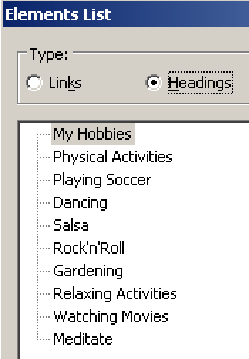
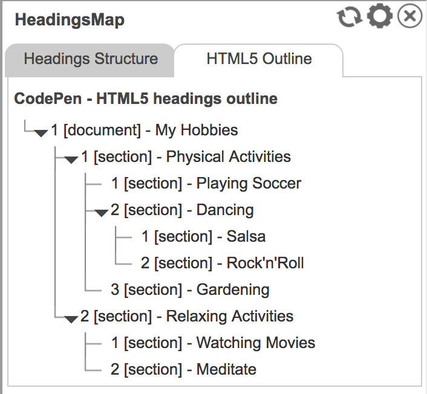
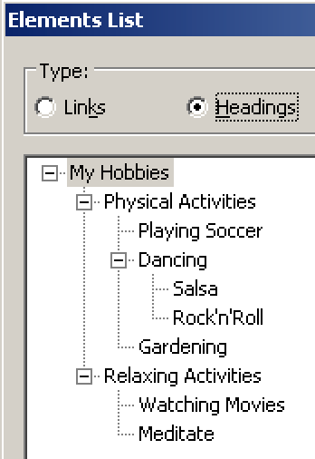

# HTML5's headings outline algorithm

# TL;DR - too long, didn't read

No single relevant assistive software supports the HTML5 outline algorithm. So you can't use it for your websites.

If it already happened though, there are ways to fix it using ARIA.

# Exhaustive explanation

The HTML5's heading outline algorithm allows to create and maintain valid heading outlines very easily by using the HTML5 structural elements like `<main>`, `<article>` and `<aside>`.

In traditional HTML, you have to choose the correct heading level rigorously depending on the current context. In HTML5, using structural elements you can start with whatever heading level you want. This makes including external content very easy, as you don't have to worry about the content's heading levels anymore (speaking about it: another way to include external content is by using an iframe, see [External Content in iFrames](/examples/iframes){.page}).

Sadly though, it isn't possible to use HTML5 heading outlines for accessible websites, as we will explain further on.

## Fact: HTML5 outlines are not accessible

The HTML5 outline algorithm sadly was never implemented by any relevant assistive software. Because of that, meanwhile even the W3C advises against using the HTML5 document outline in its HTML 5.2 draft: [Computer says NO to HTML5 document outline (html5Doctor.com)](http://html5doctor.com/computer-says-no-to-html5-document-outline/).

The following example shows the technically correct usage of the HTML5 outline algorithm.

@example[HTML5 headings outline](html5-headings-outline){.example}

On a visual level, browsers apply stylings that resemble correct indentation of nested heading levels.

Checked out with a screen reader though reveal that all headings semantically are on the very first level. What a bummer!

{.image}

## How it ought to behave

If you want to see how the same example ought to be interpreted by assistive software, check out the browser extension [HeadingsMap (Chrome)](https://chrome.google.com/webstore/detail/headingsmap/flbjommegcjonpdmenkdiocclhjacmbi) or [HeadingsMap (Firefox)](https://addons.mozilla.org/en-US/firefox/addon/headingsmap/). It has an experimental feature for displaying HTML5 outlines.

{.image}

## How to fix HTML5 outlines

As seen in [Alternative techniques for labelling page regions](/examples/headings/alternative-techniques){.page}, the HTML5 structural elements are of great value to accessibility. Sadly though, the HTML5 outline algorithm - that is made possible by them - can't be used. But there are alternatives.

### If possible: use standard HTML headings

The best is to simply avoid relying on the HTML5 outline algorithm. Instead, use the traditional HTML heading mechanism (irrespective of whether you're combining them with elements like `<main>` or `<article>`).

@example[HTML5 headings outline with traditionally numbered headings](html5-headings-outline-with-traditionally-numbered-headings){.example}

Here's the result in NVDA:

{.image}

Backwards compatibility is guaranteed with this solution.

### Otherwise: use ARIA to overrule heading levels

If you really need to use HTML5 outline, you can try to use ARIA's `role="heading"` together with `aria-level` (to set a specific level, e.g. `aria-level="3"` for heading level 3). You could do that even programmatically using JavaScript.

@example[HTML5 headings outline with ARIA level fixes](html5-headings-outline-with-aria-level-fixes){.example}

And for the sake of completeness, here's the result in NVDA:

{.image}

But remember: while this is generally working in most modern assistive software, missing backwards compatibility of ARIA can be a real problem for older software. You should only stick to this solution if you really don't have another choice. For more information, see [ARIA - when HTML simply isn't enough](/knowledge/aria){.page}.