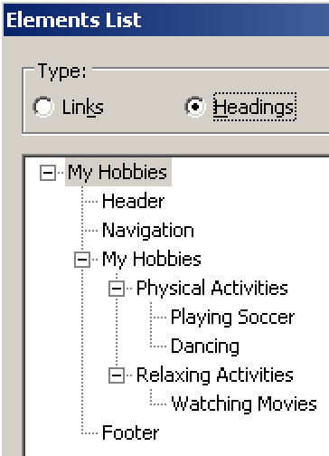
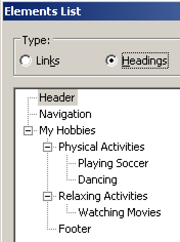

# Regarding search engine optimisation, is it okay to have multiple headings on level 1?

**Websites optimised for accessibility also result in better search engine rankings. The question regarding multiple headings on level 1 often concerns search engine optimisation (SEO) experts. While we do have a clear opinion on it (based on years of experience and intense debates with various experts) we also offer alternative solutions.**

[[toc]]

SEO experts often state that a web page must only have a single heading on level 1 (`<h1>`). According to them, like the `<title>` tag in the `<head>` of a page, this single heading on level one must describe the main content of the page. Because if there were more than one of them (SEO experts claim), search engines wouldn't be capable of deciding which one is the most important.

And sure, this may have been true some time in the past.

## We say: yes, it absolutely is!

But since the introduction of HTML 5's structural elements (like `<header>`, `<nav>`, `<main>`, etc.), these elements can provide distinguished context to regions of the page. Alas, from a semantical point of view, search engines today are 100% capable of distinguishing "main headings" (that reside in the `<main>` element) from other headings, regardless of their level.

In our opinion then, having more than one heading on level 1 is absolutely reasonable:

- At least one for the main content (that lives in the `<main>` element).
- And additional ones for labelling those other page regions like header, navigation, footer, etc.

## Alternative solutions

If you definitely do not want to have more than a single heading on level 1, we can propose you a few alternative solutions that are still pretty accessible.

### Approach #1: h1 on top of the page

One approach is to add the single heading on level 1 at the very top of the page, then indenting all other headings below.

[Example](_examples/page-with-only-one-h1-on-top-of-page)

To screen readers, this looks like so:



This way it is a bit harder for screen reader users to find the "real" main content. But by using HTML 5 elements like `<header>`, `<footer>`, and especially `<main>`, you can work around this problem effectively.

It might feel a bit awkward to have the main heading as both an `<h1>` and an `<h2>`. If you like, you can add a prefix to the heading in the `<main>` region and hide it visually (see [Hiding elements visually by moving them off-screen](/examples/hiding-elements/visually)), for example "Main content: ":

```html
<main>
  <h2>
    <span class="visually-hidden">Main Content:</span>
    My Hobbies
  </h2>
</main>
```

### Approach #2: h1 on top of the main content

If you prefer to have the single heading on level 1 directly on top of the main content, it is also okay. If you still need headings for the elements above it (for example the header), you can start on level 2 for them.

[Example](_examples/page-with-only-one-h1-on-top-of-main-content)

To screen readers, this looks like so:



This creates a heading outline which technically is a bit invalid, as it starts with a heading on level 2 (and you shouldn't skip heading levels). But screen readers fail gracefully in such situations, as you can see in the screenshot above: NVDA simply displays those invalid headings on level 1.

Another thing may really feel a bit strange though, as using this technique, the header stands on its own, while the footer is part of the main content.

This special case is accepted though by the accessibility community.