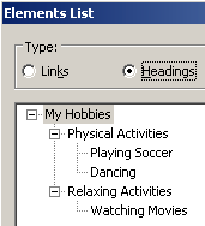
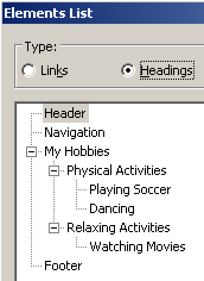

# Adding visually hidden headings to complete a page's outline

**Not only the main content of a web page needs to be marked up using headings, but also other elements like header, navigation, footer, etc. As the visual design usually does not include those headings, they need to be visually hidden by moving them off-screen.**

[[toc]]

## Additional regions on a web page

Besides the main content, a web page usually consists of many additional regions: a header, navigation(s), related sections (like advertisements), and a footer.

On the visual level, these regions typically are designed very distinct:

- The header usually sits on top of the page, consuming the full page width.
- The navigation may be part of the header, or on the left side of the main content.
- Related sections may be at the right side of the main content, or below it.
- The footer usually sits at the bottom of the page.

[Example](_examples/page-with-additional-page-regions-without-headings)

Visual website users are able to recognise these elements within the first glance at a page (if not, the visual design would be pretty bad). As a contrast, see [Screen readers process contents in a linear way using a cursor](/knowledge/screen-readers/linear-processing-using-cursor).

Screen reader users do not perceive any visual attributes like size, shape, colour, etc., see [Screen readers do not convey visual attributes](/knowledge/screen-readers/no-visual-attributes). They rely solely on semantic information and descriptive text labels. The above example is missing all additional regions in the document outline.

## Adding headings to additional regions

For screen reader users, descriptive elements are needed to give a page region a label. Again, the best way to provide such labels is using headings. So let's add those missing headings.

[Example](_examples/page-with-additional-page-regions-with-headings)

To screen reader users, the document outline now is complete.

But the additional headings mess up the visual design. How awkward!

## Hiding additional headings visually

To make sure that the additional headings do not mess up the visual design, they can be hidden visually.

[Example](_examples/page-with-additional-page-regions-with-visually-hidden-headings)

This way, all users benefit from a proper and exhaustive document outline. The technique used for this is described here: [Hiding elements visually by moving them off-screen](/examples/hiding-elements/visually).
