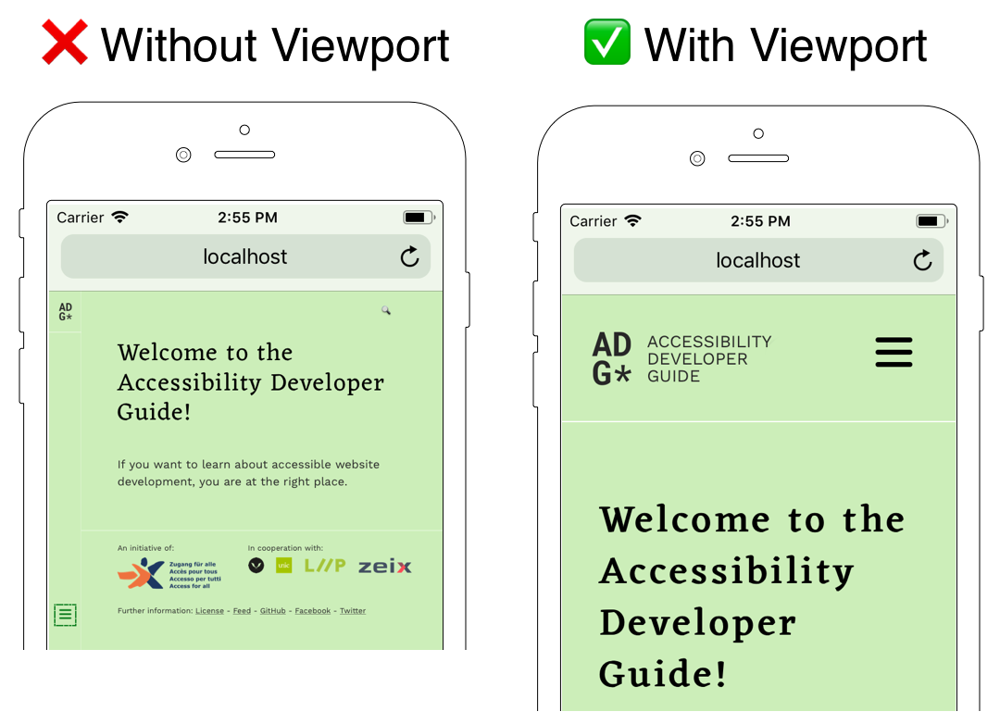

# Basic structure of an accessible HTML file

**An HTML file has a clearly defined structure that allows any browser to render the content correctly. To make an HTML file accessible you need to know the basic structure and its roles.**

[[toc]]

Each HTML file consists of a structure that includes the declaration of the document type, a header that describes the document, followed by a body that contains the actual content:

```html
<!DOCTYPE html>
<html lang="en">
  <head>
    <meta charset="utf-8" />
    <title>Add a meaningful title here</title>
    <meta name="viewport" content="width=device-width, initial-scale=1.0" />
  </head>
  <body>
    Visual content goes here.
  </body>
</html>
```

## What language are you speaking?

Humans can recognize the language a page is written simply by skimming the text. When using assistive technologies such as screen readers, it is crucial to know the language of the content in advance. In the example of a screen reader, the synthesizer needs to know which language the content is in order to pronounce the output correctly. Otherwise, it will be hard to understand, even if you know the other language.

By adding the language attribute `lang` to the HTML tag we can define the language of the enclosed content. `<html lang="en">` for example defines the documents content by default as English.

## A document should have a meaningful title

The `title` element in the header section states the purpose of the document in the browser toolbar, provides a name when a page is added to favorites, and displays the title for the page in search engine results. In addition, it plays an important role in accessibility.

```html
<title>Add a meaningful title here - ACME Inc.</title>
```

When using a screen reader, the title element will be announced after the page is loaded. This enables users to identify a website without scanning the entire content. A meaningful title could be «Contact form - ACME Inc.». Also don't forget to append your website's name in the title so the user always knows which website the current page belongs to.

In addition to the <a href="/examples/sensible-aria-usage/alert/">alert role</a> the title element can be used to gain users' attention, for example when a validation failed after submitting a form, e.g. «Contact form could not be sent. Please provide a valid email address.» or «You have successfully logged in. - ACME Inc.».

## Set the viewport to the width of the device

Good websites are responsive so that the content renders well on every device. Without setting the viewport, mobile devices render pages at a typical desktop screen size and then scale it to fit the mobile screen. In this case, the content generally appears very small. This forces users to pinch-to-zoom and scroll to scan the content. This is a challenge not only for users with special needs.



Responsiveness can be achieved by setting the viewport with to the width of the device, and an initial zoom scale of 1.

```html
<meta name="viewport" content="width=device-width, initial-scale=1.0" />
```

You have also to make sure the page can adapt to different screen sizes. With respect to accessibility, users should only have to click and scroll vertically (with the exception of a few element types that cannot be displayed in a narrow fashion, e.g. tables).
