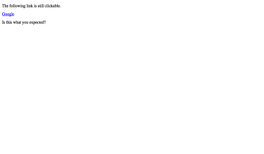

# Removing semantics using presentation role

**ARIA provides a role which removes the inherent semantics of an element. While this works in most browsers and screen readers, it is rarely needed.**

## Background

As we know from [Semantics and their importance for accessibility](/pages/knowledge/semantics), HTML elements all have their inherent role. If for some reason you need to remove this role from an element, you can do this by setting `role="presentation"`.

## Intended use

To a screen reader, the following is no paragraph anymore, and as such cannot be navigated to by pressing the `P` key:

```html
<p role="presentation">
  Hello folks!
</p>
```

[Removing semantics using presentation role (example) ](_examples/removing-semantics-using-presentation-role)

## Peculiarities

Using `role="presentation"`, only the role of an element's is removed. Any other inherent feature will remain untouched.

For example, a link with `role="presentation"` neither will be announced as "link" by NVDA nor will it be listed in NVDA's "Elements list" window (`NVDA + F7`). But it will remain being focusable like any other link, and clicking it will still open its `target` location.

[Removing a link&#39;s role (example) ](_examples/removing-a-link-39-s-role)

## Real world use (and conclusion)

There are only very few edge cases where removing semantics makes sense, usually when fiddling around with ARIA widgets (see [The purpose behind the WAI-ARIA standard](/pages/knowledge/aria/purpose)).

In general, when sticking to this guide's recommendations (especially that widgets should be created using traditional HTML controls, see [Widgets simply working for all](/pages/knowledge/semantics/widgets)), you will not need `role="presentation"` at all.