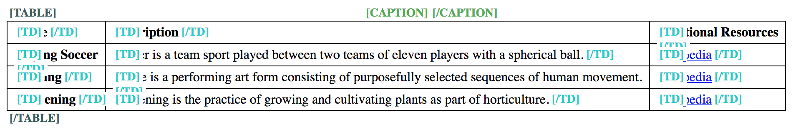

# General bad table examples

**Oftentimes, developers forget to mark up a table's header cells with the proper HTML tag. Instead, they are styled only visually as headers. But tables lacking proper header cells are tricky to navigate by screen reader users, and the more complex they are, the less they can be understood.**

Most accessibility problems regarding tables are caused due to bad semantics. So if you haven't done this yet, go back and read [Semantics and their importance for accessibility](/knowledge/semantics){.page}.

# No header cells

The table in the following example doesn't offer any real header cells (`<th>` elements); instead, only data cells are used (`<td>` elements). Those cells that are meant to be headers are only styled visually using CSS `font-weight: bold`, attached to a `.th` class.

@example[Generally bad table, without headers](generally-bad-table-without-headers){.example}

This makes it very hard for screen reader users to keep orientation, as they don't know in which column (Name? Description? Additional Resources?) and row (Playing Soccer? Dancing? Gardening?) they are. It's especially hard in the column "Additional Resources", where the cell's content doesn't offer any hint on what the Wikipedia link is about.

And while this is a very small table, you may imagine how hard it will be to browse a complex table, for example with lots of columns and rows with numerical data in it.

{.image}

# Header cells for columns, but not for rows

The table in the following example indeed has a header cell for each column (the top row), but the data rows don't have one.

@example[Generally bad table, with only horizontal headers](generally-bad-table-with-only-horizontal-headers){.example}

This makes it hard to identify the current data row when navigating the table vertically.