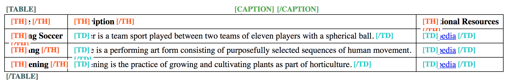

# General good table example

**Tables are widely used to display tabular data, complex or simple. HTML provides everything needed for accessibility, so cleanly laid out and marked up tables are already fully accessible all by themselves.**

The following example provides a very basic table. Navigate it using table navigation and notice how the screen reader announces the current data cell's (`<td>`) corresponding header cells (`<th>`):

- If you navigate horizontally (using `Ctrl + Alt + Left/Right`), in addition to the current cell's content, the screen reader also announces the current column's header cell.
- If you navigate vertically (using `Ctrl + Alt + Left/Right`), the screen reader announces the current row's header cell.

@example[Generally good table](generally-good-table){.example}

This provides all information needed to browse a table efficiently using a screen reader: you always know the current data cell's context, similar to a visual user. Easy and effective.

{.image}