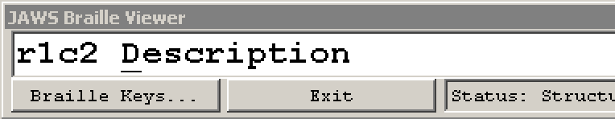

# How to handle tables

**Tables consist of solely browsable elements and do not offer any interactivity. To work through and understand the examples in this chapter, it is good to have a screen reader at hand and know how to handle it. In addition to this, there are some tools and bookmarklets that can be a huge help in your development workflow.**

[[toc]]

## Keyboard only handling

For keyboard only users, tables do not offer any special functionality. So there's nothing to say here. Still, you may want to check out [How to browse websites using a keyboard only](/knowledge/keyboard-only/browsing-websites).

## Screen reader handling

For desktop screen reader users, tables offer a lot of special functionalities. Here follows a quick nomination of the most important features. Besides this, check out [How to read websites using a desktop screen reader](/knowledge/screen-readers/desktop/reading-websites).

### Quick navigation

- `T`: jump to next table

When reaching a table, screen readers will announce the number of rows and columns, together with the table's `<caption>` (if available):

> My hobbies. Table with 4 rows and 3 columns.

You can add `Shift` to most shortcuts to reverse direction. For example press `Shift + T` to jump to the previous table.

### Table navigation

Both NVDA and JAWS provide a special navigation within tables:

- `Ctrl + Alt + Left/Right/Up/Down`: navigate to left/right/upper/lower cell

In addition to the content of the currently focused cell, this announces the column's and/or row's header cells, `<th>`:

> Row 1, column 1: Name.

#### JAWS braille viewer

In JAWS' braille viewer, next to the cell's content, the current row and column numbers are displayed like this: `r1c2` for row 1, column 2.

## Useful bookmarklets

### Contents Structured

This conveys the tag names of a lot of HTML elements, including tables. It allows fast visual examination of wrong (or missing) elements.

For more details, see [Contents Structured](/setup/browsers/bookmarklets/contents-structured).
