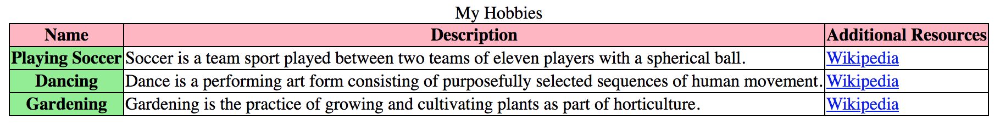
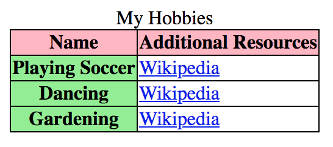
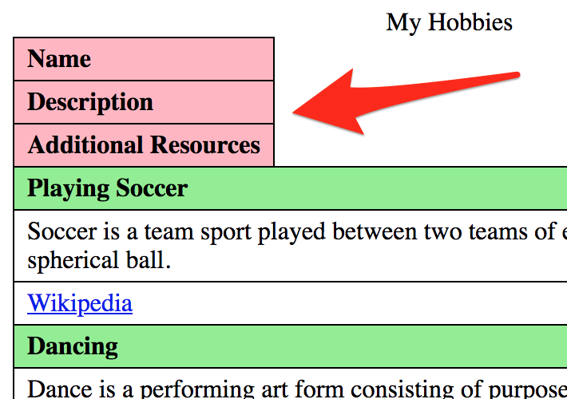
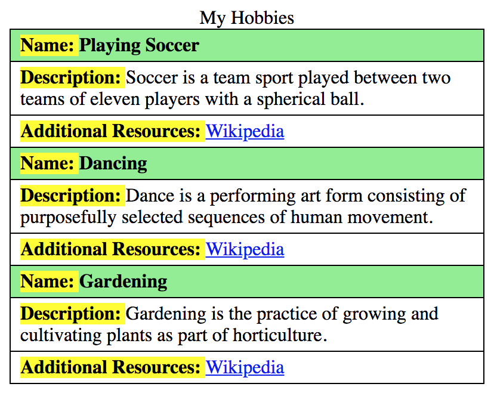

# Accessible responsive tables using ARIA

# Tables - a relict of days long gone?

Tables exist since the very early days of the internet. In and by themselves, their layout is meant to have a lot of horizontal space available.

Since portable devices like smartphones have become increasingly popular, screens have tended to become smaller and smaller. Alas, the use of traditional tables tends to be avoided increasingly by many modern websites (to prevent the need of horizontal scrolling).

However, there have been many attempts to make traditional tables responsive. For example, by stacking table data vertically (instead of horizontally) on small screens. Sadly, most of these attempts left accessibility behind.

But there are indeed ways to make tables responsive while keeping accessibility intact.

# Hiding negligible data

Sometimes, instead of transforming a traditional table's full layout into a responsive one (as will be explained below), it can be enough to simply hide some columns on smaller screens.

The following table about hobbies displays columns for a "Name", a "Description" and a link to "Additional resources".

{.image}

As the description in fact simply is taken from the linked additional resources, we can easily hide it on narrow view to save horizontal space (if you haven't done this yet, go back and read [Hiding elements from all devices](/examples/hiding-elements/from-all-devices){.page}).

{.image}

In the following example, please resize your browser to trigger narrow view. By the way, we added distinctive background colours so it will be easier for you to spot any differences.

@example[Table with hidden column in narrow view](table-with-hidden-column-in-narrow-view){.example}

There are other ways to save horizontal space. For example, you can replace wide elements (like the link to Wikipedia) with small icons in narrow view; don't forget to set a proper alternative text on it though.

# Transforming a table's visual layout

To alter a table's visual appearance, the `display` property needs to be changed. Take a look at the following example of a responsive table: when resizing the browser, you will see all elements stack on top of each other.

@example[Table with block elements in narrow view](table-with-block-elements-in-narrow-view){.example}

On narrower screens (600px and below), the table's elements are stacked above each other. This happens because they all are set to `display: block` now. So far, so good.

But there is something much more interesting to this table than the visual display. In narrow view, the element is not announced as a table anymore by many screen readers (for example NVDA). So although the HTML structure is a perfectly valid table, it is impossible to use table navigation in narrow view.

What happened?

## Lost semantics due to display changes

The `display` property is one of the few CSS properties that have an impact on accessibility. If is changed, the semantical information of an element can also change (if you haven't done this yet, go back and read [Semantics and their importance for accessibility](/knowledge/semantics){.page}).

By default, the following `display` properties are set to a basic table:

- `table` for `<table>`
- `table-header-group` for `<thead>`
- `table-row` for `<tr>`
- `table-cell` for `<th>` and `<td>`

In our example, we changed these values from their defaults to `display: block`. Alas, the inherent semantics are lost and the element is not recognised as a table anymore by screen readers. What a bummer.

## Re-applying proper semantics

Fortunately, the lost semantics can be re-applied using ARIA (if you haven't done this yet, go back and read [ARIA - when HTML simply isn't enough](/knowledge/aria){.page}).

This is done by adding a `role` attribute with the appropriate value to each element:

- `role="grid"` corresponds to `<table>`
- `role="row"` corresponds to `<tr>`
- `role="columnheader"` corresponds to `<th>` (horizontal)
- `role="rowheader"` corresponds to `<th>` (vertical)
- `role="gridcell"` corresponds to `<td>`

Now the table will be recognised properly again by screen readers.

@example[Table with ARIA roles](table-with-aria-roles){.example}

**Notice:** for both `<thead>` and `<tbody>`, there doesn't seem to exist an equivalent ARIA role. We have to apply `role="presentation"` to these elements to remove any improper semantical information (left behind by `display: block`). Otherwise this would have an impact on the semantical structure of the table, potentially breaking it once again.

## Polishing the visual layout

The example above is not fully appealing as a perfect responsive table yet. Because in narrow view, the table headers' position on top of the table feels wrong.

{.image}

### Hiding table headers visually

In a first attempt, we can hide them visually in narrow view (if you haven't done this yet, go back and read [Hiding elements visually by moving them off-screen](/examples/hiding-elements/visually){.page}). This way, they keep working for screen readers.

@example[Table with visually hidden headers in narrow view](table-with-visually-hidden-headers-in-narrow-view){.example}

### Adding visual table header per element

It would be even more beautiful if the table headers could be displayed visually next to each table cell. For this, we have to add them in each cell, but display them only in narrow view.

But this is redundant information for screen readers, so we use `aria-hidden="true"`, trying to hide those additional table headers again. This works great with NVDA, while JAWS keeps announcing them (but we can live with that).

@example[Table with added headers in narrow view](table-with-added-headers-in-narrow-view){.example}

### Final result

There we are: here you have the perfectly accessible responsive table.

{.image}

Admittedly, this has become pretty complex now. But you can easily generate this automatically - even with some post-processing JavaScript.

This solution will deliver a very good experience to all kinds of users. So in our opinion, it is totally worth the effort.