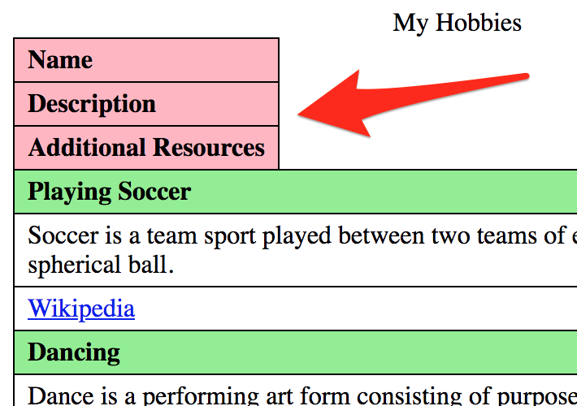

# Responsive tables

**The introduction of smartphones increasingly led web designers to avoid traditional "bulky" HTML tables - because these would exceed the limited screen dimensions. Others tried to find ways to change the layout of tables so they would not need so much horizontal space anymore. Responsive tables were born. But to make them accessible, the use of some ARIA is essential.**

[[toc]]

## Tables - a relic of days gone by?

Tables exist since the very early days of the internet. In and by themselves, their layout is meant to have a lot of horizontal space available.

Since portable devices like smartphones have become increasingly popular, screens have tended to become smaller and smaller. Alas, the use of traditional tables tends to be avoided by many modern websites (to prevent the need of horizontal scrolling).

On the other side, there have also been attempts to change the layout of traditional tables so they would fit these new requirements. Sadly, most of these attempts left accessibility behind. So we show you to change a table's visual appearance while keeping accessibility intact.

## Saving space

Instead of transforming a traditional table's full layout into a responsive one (as will be explained below), it can be useful already to simply hide some of its elements on smaller screens.

### Hiding negligible data

The following table about hobbies displays columns for a "Name", a "Description" and a link to "Additional resources".

As the description in fact simply is taken from the linked additional resources, we can easily hide it on narrow view to save horizontal space (if you haven't done this yet, go back and read [Hiding elements from all devices](/examples/hiding-elements/from-all-devices)). In the following example, please resize your browser to trigger narrow view.

[Example](_examples/table-with-hidden-column-in-narrow-view)

By the way, we added distinctive background colours so it will be easier for you to spot any differences.

### Replacing bulky elements

In the following example, the bulky "Wikipedia" links are hidden, and only small icons are shown in narrow view.

[Example](_examples/table-with-smaller-elements-in-narrow-view)

Please do not forget to set a proper alternative text to those icons.

## Changing the visual layout

Sometimes, the visual layout of a table needs to be changed completely to fit small screens.

As we already know: to alter a table's visual appearance, the `display` property can be changed, and some ARIA needs to be added (if you haven't done this yet, go back and read [Changing a table's visual layout](/examples/tables/layout-changes)). Take a look at the following example of a responsive table: when resizing the browser, you will see all elements stack on top of each other.

[Example](_examples/table-with-block-elements-in-narrow-view)

As the table is enhanced using ARIA, screen reader users are very happy with this result.

### Optimisation for visual users

Visually though, our table is not fully appealing yet, because in narrow view, the table headers' position on top of the table feels wrong.

#### Hiding table headers visually

In a first attempt, we can hide them visually in narrow view (if you haven't done this yet, go back and read [Hiding elements visually by moving them off-screen](/examples/hiding-elements/visually)). This way, they keep working for screen readers.

[Example](_examples/table-with-visually-hidden-headers-in-narrow-view)

#### Adding visual table header per element

It would be even more beautiful if the table headers could be displayed visually next to each table cell. For this, we have to add them in each cell, but display them only in narrow view.

But this is redundant information for screen readers, so we use `aria-hidden="true"`, trying to hide those additional table headers again. This works great with NVDA, while JAWS keeps announcing them (but we can live with that).

[Example](_examples/table-with-added-headers-in-narrow-view)

### Final result

There we are: here you have the perfectly accessible responsive table.

Admittedly, this has become pretty complex now. But you can easily generate this automatically - even with some post-processing JavaScript.

This solution will deliver a very good experience to all kinds of users. So in our opinion, it is totally worth the effort.
