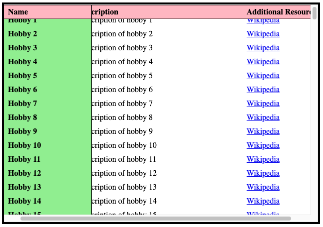

# Sticky table headers

**In some situations, table headers need to be placed at a specific place on screen, and remain there, even when scrolling.**

If tables are very long, it is useful to make the table header sticky on top so visual users always see it, even when scrolling vertically.

[Table with fixed headers (example) ](_examples/table-with-fixed-headers)

This is also possible for horizontally scrolling tables.