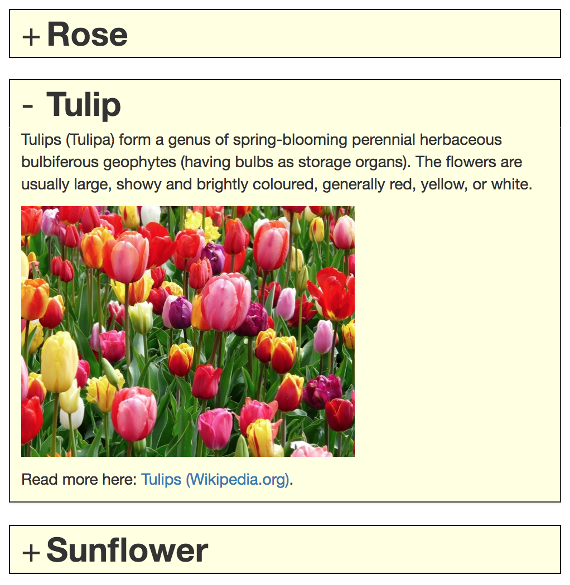

# Accordions

**Accordions consist of a number of content panels, each of which can be expanded or collapsed vertically by the user.**

[[_TOC_]]

Accordions help to save vertical space and reduce visual noise. Some accordions allow only a single panel to be expanded at a time, others allow multiple.

Before you continue, please read [Tablist widgets (or: tab panels, tabs)](/examples/widgets/tablists) to understand why accordions simply are extended variants of tablists, providing a slightly different layout and (sometimes) expandability of multiple panels.

## General requirements

The following requirements are based on well established best practices and the [WAI-ARIA Authoring Practices Guide (APG): Accordion Pattern](https://www.w3.org/WAI/ARIA/apg/patterns/accordion/).

Accordions and [Tablists](/examples/widgets/tablists) share the same underlying logic: a trigger (header/tab) controls the visibility of a content panel. While they are structurally similar, accordions have specific requirements:

- Multiple panels can be visible at the same time (optional).
- Keyboard support: Users can navigate between accordion headers using `Tab` and toggle them with `Enter` or `Space`. (Optional but recommended: Arrow key navigation).

## Proofs of concept

**Update 2020:** Due to the fact that Internet Explorer doesn’t need to be supported anymore (see [Relevant combinations of screen readers and browsers](/knowledge/screen-readers/relevant-combinations)), we now favor the [Simple ARIA implementation](#simple-aria-implementation).

### Simple ARIA implementation

It is relatively simple to create a custom accordion implementation with ARIA:

[Example](_examples/accordion-with-aria)

#### Implementation details

This implementation follows the current APG approach and uses a real `button` in each header.

- The button toggles `aria-expanded` (`true`/`false`).
- The button uses `aria-controls` to reference the associated panel.
- The panel uses `role="region"` and `aria-labelledby` to expose a clear relationship back to the controlling header button.
- The panel visibility is synchronized with the semantic state using JavaScript.

### Native HTML Disclosure Elements

For simple disclosure-like use cases, the native HTML `
` and `
` elements are a solid, no-JavaScript option. You can find the technical specification and browser behavior in the [MDN Web Docs for the Details element](https://developer.mozilla.org/en-US/docs/Web/HTML/Element/details).

- The `summary` element works as the interactive header.
- The surrounding `details` element manages the expanded/collapsed state natively.
- This removes the need for JavaScript compared to custom ARIA widgets.

[Example](_examples/accordion-with-details-summary)

#### Implementation details 

This implementation follows the current APG approach and uses a real `button` in each header.

- The button toggles `aria-expanded` (`true`/`false`).
- The button uses `aria-controls` to reference the associated panel.
- The panel uses `role="region"` and `aria-labelledby` to expose a clear relationship back to the controlling header button.
- **Keyboard Navigation:** Implementation should ideally support Arrow keys (`Up`/`Down`) to move focus between headers, and `Home`/`End` to jump to the first/last header.

### Comparison: ARIA vs. Native HTML

#### Comparison of Implementation Methods
<table>
  <caption class="visuallyhidden">Comparison of Accordion Implementation Methods</caption>
  <thead>
    <tr>
      <th scope="col">Implementation Method</th>
      <th scope="col">Advantages</th>
      <th scope="col">Limitations</th>
    </tr>
  </thead>
  <tbody>
    <tr>
      <th scope="row">Custom ARIA Implementation</th>
      <td>
        <ul>
          <li>Full control over keyboard behavior (e.g. arrow keys).</li>
          <li>Better for complex layouts/nested widgets.</li>
          <li>Exact state control via JS.</li>
        </ul>
      </td>
      <td>
        <ul>
          <li>Requires JavaScript for state and interaction.</li>
          <li>Higher maintenance (must handle all ARIA states manually).</li>
        </ul>
      </td>
    </tr>
    <tr>
      <th scope="row">Native Disclosure Elements (<code>&lt;details&gt;</code>)</th>
      <td>
        <ul>
          <li>Works without JavaScript.</li>
          <li>Native accessibility "out of the box".</li>
          <li>Minimal code footprint.</li>
        </ul>
      </td>
      <td>
        <ul>
          <li>Limited styling options.</li>
          <li>No native support for "only one open" (requires JS).</li>
          <li>Default keyboard support is limited to Tab/Space/Enter.</li>
        </ul>
      </td>
    </tr>
  </tbody>
</table>

### Legacy implementations (Historical)

**Note:** The following legacy variants are deprecated and provided for historical reference only.

For all new projects, use one of the recommended implementations above (ARIA or native `
`/`
`, depending on your requirements).

[Accordion with radio buttons](_examples/accordion-with-radio-buttons) *(Legacy — for reference only)**  
[Multi accordion with checkboxes](_examples/multi-accordion-with-checkboxes) *(Legacy — for reference only)*
