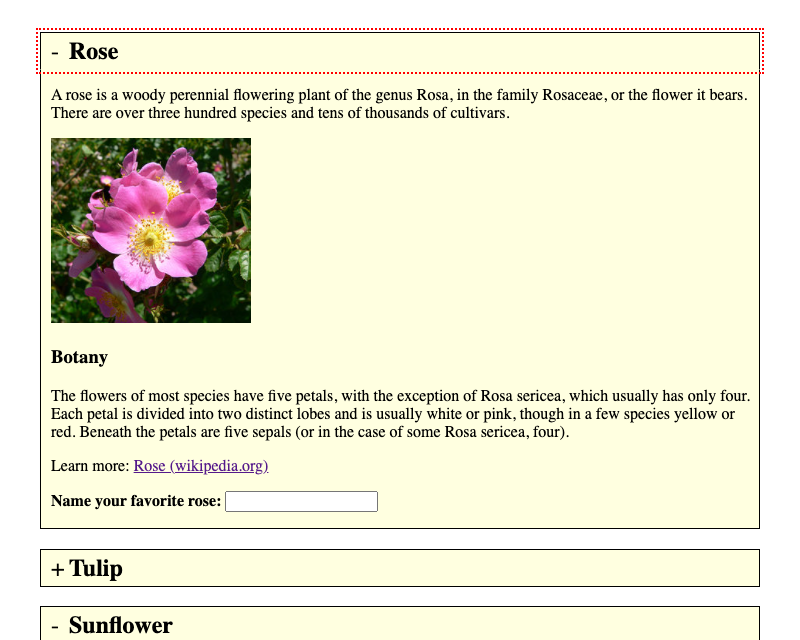

# Accordions

**Accordions contain of a number of content panels, each of wich can be expanded or collapsed vertically by the user.**

Accordions help to save vertical space and prevent from visual noise. Some accordions allow only a single panel to be expanded at a time, others allow multiple.

Before you continue, please read [Tablist widgets (or: tab panels, tabs)](/pages/examples/widgets/tablists) to understand why accordions simply are extended variants of tablists, providing a slightly different layout and (sometimes) expandability of multiple panels.

## General requirements

In addition to the tablists' requirements:

- Multiple slides can be visible (optional).

Find more detailed requirements here: [WAI-WAI-ARIA Authoring Practices: Accordion (widget)](https://www.w3.org/TR/wai-aria-practices/#accordion).

## Proofs of concept

### Radio buttons implementation

Based on the tablists' proof of concept, simply the layout is different.

[Accordion with radio buttons (example) ](_examples/accordion-with-radio-buttons)

### Checkboxes implementation

Based on the tablists' proof of concept, with a slightly different layout:

[Multi accordion with checkboxes (example) ](_examples/multi-accordion-with-checkboxes)

#### Implementation details

Some interesting peculiarities:

- Checkboxes replace the radio buttons to offer multiple selection.
    - We waived using a `<fieldset>`/`<legend>` structure, as this is no traditional group of checkboxes, and JAWS tends to be very wordy with focusable items nested within those, see [Grouping form controls with fieldset and legend](/pages/examples/forms/grouping-with-fieldsetlegend).
- By default, only the `Space` key is used to toggle a checkbox (while pressing `Enter` submits a form).
    - To make it more intuitive for visual users (who don't know about any checkbox behind the scenes, and thinking they are interacting with a link or button), the `Enter` key was re-wired to also toggle the checkboxes.

### Simple ARIA implementation

Instead of using radio buttons or checkboxes, it is relatively simple to create a custom carousel implementation with ARIA:

[Accordion with ARIA (example) ](_examples/accordion-with-aria)

#### Implementation details

A link with an `aria-expanded="true"` attribute is placed around each panel's header; its value (`true`/`false`) and the visibility of the corresponding panel is toggled using JavaScript. See [Marking elements expandable using aria-expanded](/pages/examples/sensible-aria-usage/expanded).

While this may feel tempting in some circumstances, there are several drawbacks:

- It needs more JavaScript (instead of relying on browser standard behaviour).
- This solution is less intuitive: a screen reader announcement "link X collapsed" is less expressive than "show panel X checkbox not checked" or "show panel X radio button not checked 2 of 3".
- Missing backwards compatibility for older clients with incomplete/missing ARIA support.