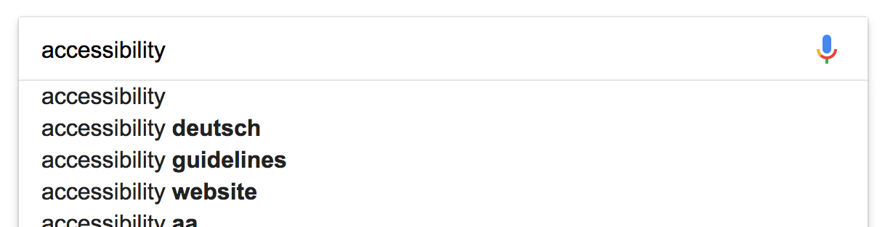

# Autosuggest widget (or: autocomplete, lookahead, typeahead)

**Autosuggests offer a number of possible values, usually presented as some sort of a dropdown element, allowing to select one. By entering a filter string, the possible values are filtered.**

Best known from search fields (like [Google](https://www.google.com) or [YouTube](https://www.youtube.com)), autocompletes immediately offer suggestions based on the user's input.

We do not call autosuggests "autocompletes" so the difference to HTML's `autocomplete` attribute is obvious.

## General requirements

The autosuggest is one of many interactive usage patterns that have made its way into the collective awareness of the web, but for which no native HTML standard element is available. Alas, there exist no strict requirements, and most implementations of the pattern vary greatly regarding their functionalities and target audiences.

The following requirements are based on well established best practices. Unlike most other common widget patterns, the [WAI-ARIA Authoring Practices](https://www.w3.org/TR/wai-aria-practices/) don't offer a section about autosuggests.

Besides many other requirements, we want to stress out explicitly the following:

- The meaning and usage of the autosuggest must be clear.
- If possible, the total number of suggestions should be perceivable ("3 suggestions in total" or similar).
- Proper feedback must be given upon entering a filter ("2 suggestions available for X" or similar).
- The autosuggest must be operable using both keyboard only and screen reader (with a reasonable interplay of default keys like `Tab`, `Enter`/`Space`, `Esc`, `Arrow` keys).

## Proof of concept

Before you go on, please read [What is a "Proof of concept"?](/pages/examples/widgets/proof-of-concept).

According to our credo [Widgets simply working for all](/pages/knowledge/semantics/widgets), we advise to create autosuggests as combination of a text input, acting as filter, and a group of radio buttons, acting as the options. They can be styled visually as needed using CSS, and spiced up with (very little) JavaScript, so they behave like perfect autosuggests.

Sensible naming of elements (and a few specifically added visually hidden texts and alerts) guarantees that screen reader users know how to handle the element - even if they have not seen any other autosuggest before.

[Autocomplete with radio buttons (example) ](_examples/autocomplete-with-radio-buttons)

### Implementation details

Some interesting peculiarities:

- The filter input has:
    - A descriptive text attached to it using `aria-describedby` (see [Adding descriptions to elements using aria-describedby](/pages/examples/sensible-aria-usage/describedby)), giving a clue that the element provides suggestions upon entering text, and how many options there are available.
    - An `aria-expanded="true"` attribute (see [Marking elements expandable using aria-expanded](/pages/examples/sensible-aria-usage/expanded)), giving a clue that there is something to be expanded (the suggestions).
    - An `autocomplete="off"` attribute so it does not trigger the browser's autocomplete feature (which remembers previous user input and offers it again).
- The suggestions appear upon pressing `Up`/`Down`, `Esc`, or upon a first character is entered into the filter input.
- The suggestions are filtered by the characters entered by the user.
    - The individual radio buttons are hidden from all devices using `display: none`, see [Hiding elements from all devices](/pages/examples/hiding-elements/from-all-devices).
- The number of available options is always announced by the screen reader.
    - This is done using `role="alert"`, see [Noticing screen readers using alert role](/pages/examples/sensible-aria-usage/alert).
- Using `Up`/`Down`, an option can be selected.
    - In the background, the radio button values are toggled using JavaScript, and the currently selected radio button's label is entered into the filter (which itself leads screen readers to announce the filter's new value).
- The suggestions can be hidden by pressing `Esc`.