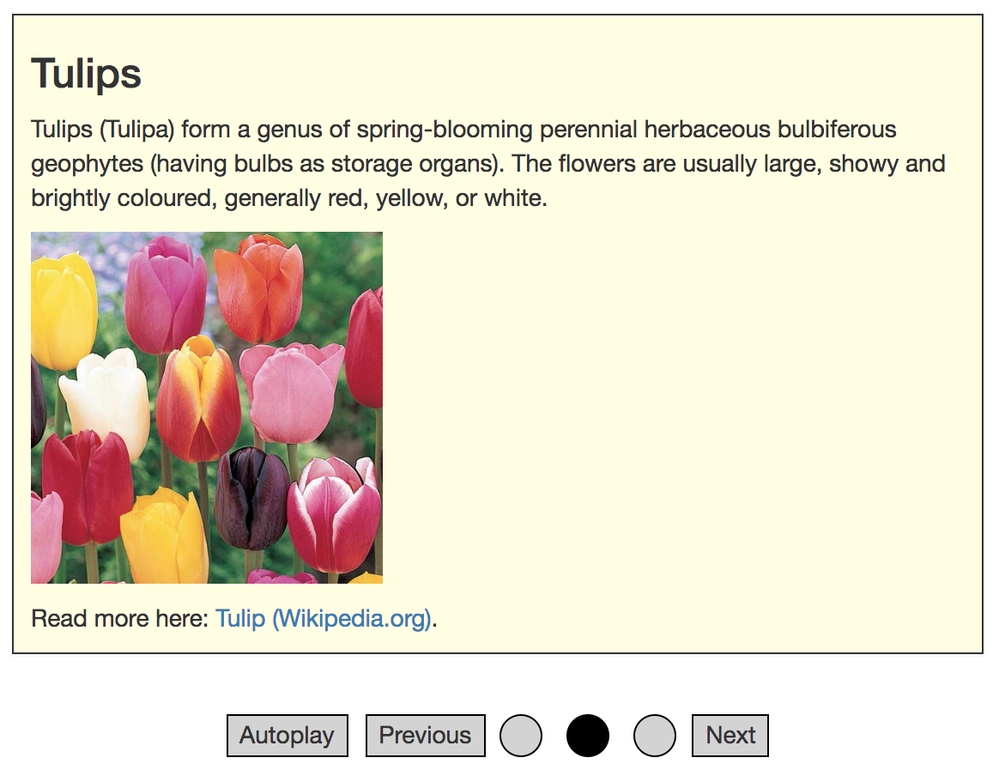

# Carousels (or: slideshow, slider)

**Very similar to tablists, carousels also help to split up a page's content into smaller and thus more digestible parts which can be toggled visible one at a time.**

[[toc]]

Carousels are well known especially from photo galleries. They offer a list of controls (usually on top of the element) which allow to toggle the visibility of corresponding panels. Only a single control can be active at a time, so exactly one panel is visible and all others are hidden.

We do not call carousels "sliders" so the difference to the slider pattern (selecting a value in a min/max range) is obvious.

Before you continue, please read [Tablist widgets (or: tab panels, tabs)](/examples/widgets/tablists) to understand why carousels are extended variants of tablists, simply providing additional controls like previous/next buttons, and sometimes autoplay functionality.

## General requirements

The following requirements are based on well established best practices; unlike most other common widget patterns, the [WAI-ARIA Authoring Practices](https://www.w3.org/TR/wai-aria-practices/) do not offer a section about carousels.

In addition to the tablists' requirements, and besides many other requirements, we want to stress out explicitly the following:

- Previous/next buttons allow to toggle through available slides (optional).
- Autoplay functionality toggles through available slides automatically (optional).
    - Autoplay functionality must be pauseable.

## Proof of concept

Based on the tablists' proof of concept, with additional controls:

[Example](_examples/carousel-with-radio-buttons)

### Implementation details

Some interesting peculiarities:

- Previous/next controls are implemented as buttons and simply change the currently active radio button.
    - The currently active panel is announced using `role="alert"`, see [Noticing screen readers using alert role](/examples/sensible-aria-usage/alert).
- Autoplay functionality is implemented using a simple timer that clicks the "Next" button every 2 seconds, as long as the "Autoplay" button has `aria-pressed="true"`, see [Marking elements activatable using aria-pressed](/examples/sensible-aria-usage/pressed).
    - The autoplay functionality can be toggled: it simply changes the value of `aria-pressed="true"`.
    - It is important that the autoplay button is before the radio buttons in the DOM, so screen reader users can disable it before interacting with them.
- Using `.carousel:focus-within .control label`, a style can be applied to all radio button labels upon interacting with the carousel.
    - This gives users a clue that they are interacting with a single control now (indicating to use the `Arrow` keys instead of `Tab` to navigate through carousel items).
    - It also separates those controls clearly from other controls like Autoplay, and previous/next, which are accessed using `Tab` key.
- By giving the "Autoplay" a dedicated style (bold) upon `[aria-pressed="true"]`, its status is also perceivable to visual users.
