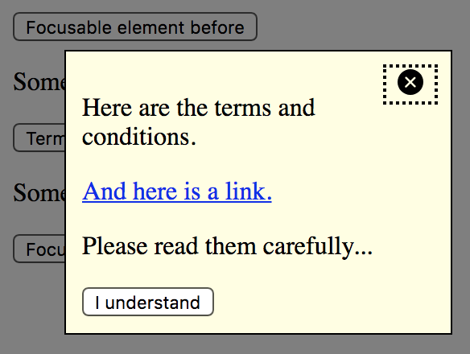

# Dialog widget (or: modal, popup, lightbox, overlay, alert)

**Dialogs display some information on top of a page. They are typically used to react upon a user action, for example to display a notice or to ask for some input like confirming something. There are dialogs that disable the rest of the page in the background (modal), while others do not (non-modal).**

[[toc]]

## General requirements

The following requirements are based on well established best practices and [WAI-ARIA Authoring Practices: Dialog Modal (W3.org)](https://www.w3.org/TR/wai-aria-practices/#dialog_modal).

Besides many other requirements, we want to stress out explicitly the following:

- The meaning and usage of the dialog must be clear.
- The dialog must be operable using both keyboard only and screen readers (with a reasonable interplay of default keys like Tab, Enter/Space, Esc, Arrow keys), as well as mobile screen readers.
- Focus must be placed inside the dialog upon opening, and placed back upon closing.
- Modal dialogs must track focus.
- It must be evident where a dialog's content begins and where it ends.

By the way, non-modal dialogs are very similar to:

- Complex tooltips, see [Tooltip widgets (or: screen tip, balloon)](/examples/widgets/tooltips)
- Dropdowns, see [Dropdown widget (or: menu, pulldown)](/examples/widgets/dropdown)

## Proofs of concept

Before you go on, please read [What is a "Proof of concept"?](/examples/widgets/proof-of-concept).

### Non-modal dialog

This dialog simply displays some content above the page, while the rest of the page remains fully functional.

[Example](_examples/non-modal-dialog)

#### Implementation details

Some interesting peculiarities:

- Each dialog toggler has an `aria-expanded="false"` attribute; its value (`true`/`false`) and the visibility of the corresponding dialog is toggled using JavaScript. See [Marking elements expandable using aria-expanded](/examples/sensible-aria-usage/expanded).
- The dialog is toggled using `hidden` attribute (see [Hiding elements from all devices](/examples/hiding-elements/from-all-devices)).
- The dialog's first element is a "Close dialog" button.
    - Upon opening the dialog, the focus is set on this button, which announces its caption; this way users immediately know they are in a dialog now.
    - The button has a visible SVG icon (also an image with empty `alt` attribute would work), and a visually hidden text (see [Hiding elements visually by moving them off-screen](/examples/hiding-elements/visually)).
    - Upon clicking it, the dialog is closed and focus is set on the dialog toggler again button, which makes screen readers announce its caption; this way users immediately know they are out of the dialog now.
- The dialog's last element is a "Confirm" button.
    - Upon clicking it, the dialog is closed and focus is set on the dialog toggler again button, which makes screen readers announce its caption; this way users immediately know they are out of the dialog now.

Adding more sophisticated features like movability using drag and drop or similar would be easy. For simplicity though, we refrained from doing this.

### Modal dialog

This dialog displays some content above the page, traps the focus (so the dialog cannot be left) and darkens the background (to indicate that the rest of the page cannot be interacted while the dialog is open).

Modal dialogs are used when immediate user interaction is required, for example a prompt like "Are you really sure you want to empty your shopping cart?".

[Example](_examples/modal-dialog)

#### Implementation details

Some interesting peculiarities:

- Keyboard focus is trapped by intercepting `Tab` (and `Shift + Tab`) on the first and last button, then moving the focus manually back and forth between them.
- The screen reader cursor is trapped by surrounding the dialog with both a `role="dialog"` container and a `role="document"` container.
    - The `role="dialog"` container traps the focus, and forces some screen readers to remain in focus mode (so browsable content is not readable).
    - The `role="document"` container re-enables switching to browse mode.
- The curtain is implemented with an independent container and a semi-transparent background colour.
    - Some implementations allow clicking the curtain to dismiss a dialog. While this would be easy to implement, we omitted it for simplicity reasons.

## Further discussions

### Headings in dialogs

Some dialogs contain a lot of content, and this usually needs to be structured semantically. You should structure content of dialogs like any other content on the page. Be sure though that it fits into the general page structure.

For example, when using headings in a dialog, make sure that they fit nicely into the heading structure of the page around it. It can be an easy and pragmatic approach to start each dialog with its own heading level 1 `<h1>` to separate it clearly from the rest of the page.

### Positioning in the DOM

There is no general rule where dialogs should be placed in the DOM.

For non-modal dialogs, it usually makes sense to place them near the toggler button, so the tabbing sequence (which includes both dialog and background elements) remains meaningful.

For modal dialogs, the background is fully disabled thanks to `role="dialog"`, so their position may not be important. But for backwards compatibility with devices that do not support `role="dialog"` (and thus do not trap focus), it can be sensible to either place dialogs near the toggler button (like non-modal dialogs), or at the very bottom of the page.

### HTML 5 dialog element

In HTML 5 exists a `<dialog>` container.

While some browsers support this element already, it is not yet supported by some major browsers. So from an accessibility point of view, you are better off using a custom dialog instead of `<dialog>` (yet).
