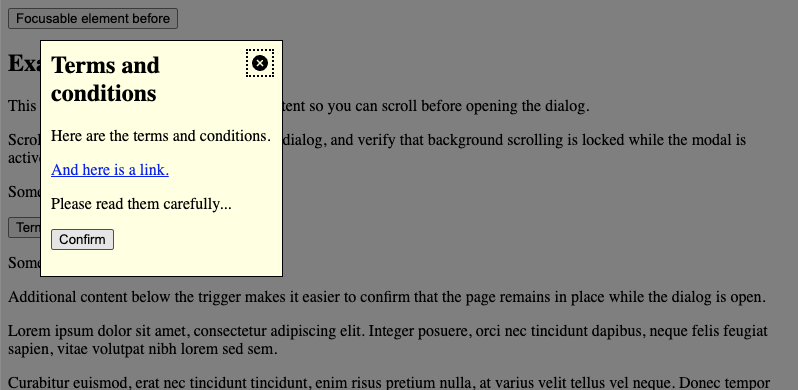

# Dialog widget (modal, popup, lightbox, overlay)

**Dialogs display contextual content above the page. Use them for confirmations, short tasks, or additional details.**

[[_TOC_]]

## General requirements

The following requirements are based on established best practices and the WAI-ARIA Authoring Practices [Dialog Modal Pattern](https://www.w3.org/WAI/ARIA/apg/patterns/dialog-modal/).

To fulfil WCAG 2.2 standards, accessible dialogs must meet these criteria:

- **Predictable Focus:** Focus moves into the dialog when it opens and returns to the triggering element when it closes (SC 2.4.3).
- **Keyboard Control:** The dialog is fully operable via keyboard, including `Tab` navigation and a clear mechanism to close it (e.g. `Esc`) (SC 2.1.1).
- **Focus Trapping:** Modal dialogs keep focus within the dialog while open.
- **Semantics:** The dialog has a clear accessible name (e.g. via `aria-labelledby`) and uses either the native `<dialog>` element or `role="dialog"`.

### Decision matrix

<table>
  <caption class="visuallyhidden">Dialog implementation decision matrix</caption>
  <thead>
    <tr>
      <th scope="col">Aspect</th>
      <th scope="col">Native <code>&lt;dialog&gt;</code></th>
      <th scope="col">Custom dialog (ARIA)</th>
    </tr>
  </thead>
  <tbody>
    <tr>
      <th scope="row">Effort</th>
      <td>Low</td>
      <td>High</td>
    </tr>
    <tr>
      <th scope="row">Focus handling</th>
      <td>Mostly handled by browser</td>
      <td>Must be implemented manually</td>
    </tr>
    <tr>
      <th scope="row">Top layer</th>
      <td>Automatic</td>
      <td>Manual (<code>z-index</code> management required)</td>
    </tr>
    <tr>
      <th scope="row">Background interaction</th>
      <td>Automatically blocked via <code>showModal()</code></td>
      <td>Requires <code>inert</code> or equivalent</td>
    </tr>
  </tbody>
</table>

Before you continue, please read [What is a "Proof of concept"?](/examples/widgets/proof-of-concept).

## Proofs of concept

### Native modal dialog

This variant uses the native HTML `<dialog>` element and should be the default choice for modern projects.
Use this variant when you need modal behaviour with low implementation effort and reliable built-in browser handling.

[Example](_examples/native-dialog)

#### Implementation details

- **Activation:** Use `.showModal()` to open the dialog in the browser's top layer.
- **Backdrop:** Style using the `::backdrop` pseudo-element.
- **Keyboard behaviour:** Browsers generally keep focus within the dialog and support closing via `Esc`, consistent with platform conventions.
- **Focus return:** Browsers typically restore focus to the previously focused element when `.close()` is called.
- **State:** Do not rely on the `open` attribute alone for modal behaviour.

### Non-modal dialog

This variant displays content above the page while background content remains interactive.
Use this variant when users must continue interacting with the underlying page while keeping contextual information visible.

[Example](_examples/non-modal-dialog)

#### Implementation details

- **Visibility:** Toggle using the `hidden` attribute to remove it from rendering and the accessibility tree when closed.
- **State indication:** `aria-expanded` may be used if the dialog behaves like a disclosure pattern.
- **Focus handling:** Move focus to a meaningful element when opened. Do not trap focus.
- **DOM position:** Place markup close to the trigger to preserve logical tab order.

### Custom modal dialog

This variant recreates modal dialog behaviour with ARIA semantics and custom JavaScript logic.
Use this only when native `<dialog>` cannot be used.

[Example](_examples/modal-dialog)

#### Implementation details

- **Role and name:** Use `role="dialog"` and `aria-labelledby`.
- **Focus trap:** Implement manual focus management for `Tab` and `Shift + Tab`.
- **Keyboard interaction:** Provide an explicit `Esc` handler.
- **Inertness:** Mark background content as `inert` (or equivalent) while open.

## Further discussions

### Headings in dialogs

- **Modal dialogs:** May act as self-contained contexts; `<h2>` is usually a safe default.
- **Non-modal dialogs:** Should follow the existing page hierarchy.

### Positioning in the DOM

- **Native `<dialog>`:** Placement is flexible, but proximity to the trigger improves maintainability.
- **Custom dialogs:** Often placed at the end of `<body>` to avoid layout issues.

### Initial focus positioning

By default, focus the first focusable element in the dialog. Consider these exceptions:

- **Destructive actions:** For confirmation dialogs (e.g. deletion), focus `Cancel` rather than `Delete` to reduce accidental data loss.
- **Long content:** Focus the dialog title (`tabindex="-1"`) so screen readers start reading from the top of the content.

### Backdrop interaction

Users often expect a modal to close when they click the backdrop.

- **Implementation:** With native `<dialog>`, detect clicks on the dialog element itself (the backdrop is part of the box model) and call `.close()`. Ensure the click target is strictly the `<dialog>` and not its children, to prevent the dialog from closing when clicking inside the modal content.

### Preventing background scrolling

When a modal is open, background page content should not be scrollable.

- **Native:** Handled automatically by `.showModal()`.
- **Custom:** Apply `overflow: hidden` to `<body>` while the dialog is active.
