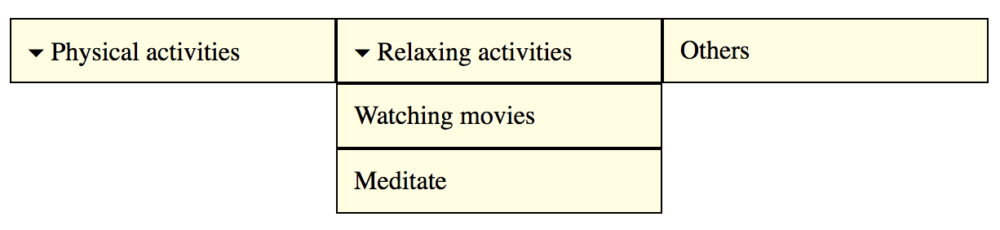

# Dropdown widget (or: menu, pulldown)

**Dropdowns allow to toggle an element's visibility. They usually contain some sort of navigation, be it a bare list of links, or more complex elements. They can offer one to multiple nesting levels.**

[[toc]]



We do not call dropdowns simply "menu" as dropdowns can have a much wider field of application than menus of traditional applications.

## General requirements

The following requirements are based on well established best practices and [WAI-ARIA Authoring Practices: Menu Widget (W3.org)](https://www.w3.org/TR/wai-aria-practices/#menu).

Besides many other requirements, we want to stress out explicitly the following:

- The meaning and usage of the dropdown must be clear.
- The dropdown must be operable using both keyboard only and screen readers (with a reasonable interplay of default keys like `Tab`, `Enter`/`Space`, `Esc`, `Arrow` keys), as well as mobile screen readers.
- Proper feedback must be given upon opening/closing a dropdown.

By the way, dropdowns are very similar to:

- Non-modal dialogs, see [Dialog widget (or: modal, popup, lightbox, alert)](/examples/widgets/dialog)
- Complex tooltips, see [Tooltip widgets (or: screen tip, balloon)](/examples/widgets/tooltips)

## Proof of concepts

Before you go on, please read [What is a "Proof of concept"?](/examples/widgets/proof-of-concept).

### Simple dropdown

This simple dropdown offers a single expandable level.

[Example](_examples/simple-dropdown)

#### Implementation details

Some interesting peculiarities:

- Each dropdown toggler has an `aria-expanded="false"` attribute; its value (`true`/`false`) and the visibility of the corresponding content is toggled using JavaScript. See [Marking elements expandable using aria-expanded](/examples/sensible-aria-usage/expanded).
- The dropdown's content is toggled using `hidden` attribute (see [Hiding elements from all devices](/examples/hiding-elements/from-all-devices)).
- Dropdown togglers are implemented as `<button>` elements (in contrast to the links, see below for further explanations).
- By using nested lists, screen readers can announce when entering (and leaving) lists, and the total number of elements of the current list.

Adding more sophisticated keyboard interaction features like closing a dropdown using `Esc` or navigating it using `Arrow` keys would be easy. For simplicity though, we refrained from doing this.

### Multi-level dropdown

Some dropdowns offer more than a single nesting level. Simply add more nested lists to make this happen:

[Example](_examples/multi-level-dropdown)

It is debatable how user friendly menus with deeply nested levels really are though. A good compromise is to keep the nested lists, but without the need of toggling their visibility.

[Example](_examples/multi-level-dropdown-with-sub-levels-always-open)

Admittedly, this is already pretty close to a mega dropdown (see below).

### Double-purpose dropdown

Another use case is dropdowns serving a double-purpose: offering both toggling a dropdown and navigating to an element.

There are implementations of this pattern that realise this with a single element:

- When hovering it, the dropdown is opened.
- When activating it, the browser navigates to an URL.

The problem with this is that the `hover` event is only available to pointing devices (like a mouse): whether keyboard only, nor screen reader, nor touch screen users would be able to use such an implementation (for further discussion about `hover`, see below).

The best bet for this requirement is to implement both an element for toggling the dropdown and for navigating to an element:

[Example](_examples/double-purpose-dropdown)

### Mega dropdown

A mega dropdown can contain much more than a simple collection of links: it can contain (nearly) everything that is structured content, be it paragraphs, images, form elements, etc.

[Example](_examples/mega-dropdown)

## Further discussions

### What elements belong in dropdowns?

As explained above, mega dropdowns can contain structured content of various kind. Be sure not overuse this possibility though. For example, stuffing "big" structural elements like headings (`<h1>` to `<h6>`) or HTML 5 sectioning elements (like `<article>` or `<header>`) into these pretty basic structures of nested lists (`<ol>`) does not feel right.

If you really want to do something like that though, you should rather think of it as non-modal dialogs, see [Dialog widget (or: modal, popup, lightbox, alert)](/examples/widgets/dialog).

### Comboboxes as alternative?

In earlier days, comboboxes (together with some JavaScript) were often used as simple alternative to dropdown menus.

```html
<fieldset>
  <legend>Quick navigation</legend>

  <select>
    <option>Home</option>
    <option>Products</option>
    <option>Help</option>
    <option>About</option>
  </select>

  <button>Go!</button>
</fieldset>
```

This remains a valid technique up to the present day, and using `<optgroup>`, the dropdown can even be nested to a single level.

As these standard controls' styling capabilities are limited though, they are seldom used nowadays.

### Toggle on hover?

There is a big debate whether dropdown menus should open on `hover`. First of all: unintentional hovering may cause flickering of elements. But there are also confusing (if not disrupting or even misleading) behaviours attached to dropdowns that open (or close) on hover.

Look at this scenario: a user hovers over a dropdown and clicks on it, but nothing seems to happen. This is due to the fact that the dropdown already was triggered to open by hover, and clicking on it closes it immediately again.

An even worse scenario is this: a user wants to click an element right below a closed dropdown. While moving the mouse over the dropdown (which is of no interest to the user at this time), the hover event opens the dropdown and overlaps the target element, causing the fast user to click on an element in the dropdown instead.

The worst are elements that toggle a dropdown on hover and navigate to a website by activation. This is extremely confusing for all sorts of users (be it with or without special needs), and pretty hard to implement in an accessible way.

There are a lot of tricks and workarounds to minimise the problems depicted above, like using timeouts or visual effects. But in general, the problems remain, and the workarounds potentially lead to new side effects (or even less intuitive behaviours).

In our opinion, hovering events should only be used for purely visual purposes, and toggling the visibility of content is by no means purely visual. So it is much better to only open (and close) dropdowns on dedicated activation by the user.

### Links or buttons?

In our dropdown implementations, we use `<button>` elements to toggle dropdowns. In other implementations however, these are often implemented as `<a href="#"`>, `<a href="javascript:;">`, or similar, which is clearly less appropriate.

While `<button>`s clearly indicate some interactivity, links suggest users to navigate somewhere. So changing an element's visibility is clearly a moment of interaction, not of navigation. And although in earlier days buttons could not be styled as well as links, this changed a lot recently, so there is no excuse anymore for mis-using links as buttons.
