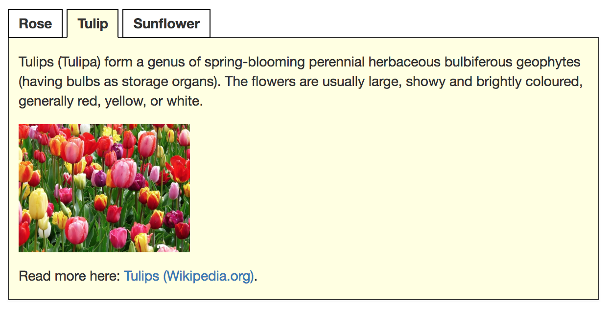

# Tablist widgets (or: tab panels, tabs)

**Tablists are used to divide complex page content into smaller, more manageable sections. Each section is represented by a tab label that allows users to display one panel at a time. In this sense, tablists can be understood as small, self-contained page fragments within a larger page.**

[[_TOC_]]

Tablists are well known as native controls in many operating systems: a list of controls (usually on top of the element) allows to toggle the visibility of corresponding panels. Only a single control can be active at a time, so exactly one panel is visible and all others are hidden.

We use the term *tablist* instead of simply *tabs* to avoid confusion with the `Tab` key used for keyboard navigation.

---

## General requirements

The following requirements are based on established best practices and the [WAI-ARIA Authoring Practices: Tab Panel Widget](https://www.w3.org/TR/wai-aria-practices/#tabpanel).

In particular, a compliant tablist must fulfil the following criteria:

- The purpose and usage of the tablist must be clearly understandable.
- The active and inactive states of tabs must be visually and programmatically perceivable.
- Users must receive clear feedback when a tab is activated.
- The tablist must be fully operable using:
  - keyboard only,
  - screen readers (desktop and mobile),
  - standard interaction keys (`Tab`, `Enter`/`Space`, `Esc`, arrow keys).
- Panel content must be easily accessible via keyboard and assistive technologies.

---

## Similarities with accordions and carousels

Although tablists, accordions, and carousels appear visually different, they all address the same fundamental use case: controlling the visibility of related content sections.

- **Tablists** provide the most basic pattern: one active panel at a time.
- **Carousels** extend this pattern with previous/next controls and optional autoplay.
- **Accordions** stack controls and panels vertically and may allow multiple panels to be open simultaneously.

Because of these similarities, many of the following principles also apply to:

- [Carousels](/examples/widgets/carousel)
- [Accordions](/examples/widgets/accordion)

---

## Proofs of concept

Before continuing, please read [What is a "Proof of Concept"?](/examples/widgets/proof-of-concept) (POC).

ARIA is well supported for tablists across modern browsers and assistive technologies. For new projects, an ARIA-based implementation is recommended, as it provides correct semantics and consistent behaviour.

---

### POC #1: ARIA (Recommended)

This implementation follows the  
[WAI-ARIA Authoring Practices Guide for Tabs](https://www.w3.org/WAI/ARIA/apg/patterns/tabs/)  
and uses **manual activation**. Users activate a focused tab using `Enter`, `Space`, or a mouse click.

Manual activation is recommended when panel content cannot be displayed instantly.

The implementation uses appropriate:

- Roles: `tablist`, `tab`, `tabpanel`
- States: `aria-selected`
- Relationships: `aria-controls`, `aria-labelledby`

This ensures reliable screen reader support across browsers and platforms.

[Example](_examples/tablist-with-aria)

#### Implementation details

- Uses the roving tabindex pattern:
  - Active tab: `tabindex="0"`
  - Inactive tabs: `tabindex="-1"`
- Keyboard interaction:
  - `Arrow Left/Right`: Move focus between tabs
  - `Home/End`: Move focus to first/last tab
  - `Enter/Space`: Activate focused tab
  - `Tab`: Move focus out of the tablist
- Tab elements use `display: block` (instead of `inline-block`) to improve navigation in NVDA browse mode.
- Tabs are laid out horizontally using flexbox.
- Focus management ensures that only one panel is visible at a time.
- ARIA attributes establish clear relationships between tabs and panels.

---

### POC #2: Radio buttons (Legacy)

**Note:** This approach is deprecated and provided for reference only.

The ARIA-based implementation (POC #1) should be used for all new projects, as it offers correct semantics and more reliable support for modern assistive technologies.

The radio button approach was previously used as a simpler alternative based on native form controls. However, it does not provide proper tab semantics and requires significant workarounds to achieve comparable accessibility.

[Example](_examples/tablist-with-radio-buttons)  
*(Legacy — for reference only)*
