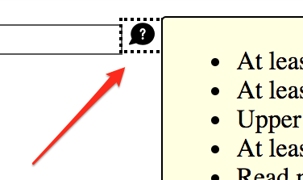

# Tooltip widgets (or: screen tip, balloon)

**Tooltips present information about a specific element in a small container on top of all other content. It is typically only displayed upon interacting with the related element in some way. Depending on the richness of its content, it is shown upon hovering or focusing the related element, or by manually toggling its visibility.**

[[toc]]

Tooltips are well known as native controls in many operating systems, for example for unobtrusively displaying warnings or alerts.

## General requirements

The following requirements are based on well established best practices and [WAI-ARIA Authoring Practices: Tooltip Widget (W3.org)](https://www.w3.org/TR/wai-aria-practices/#tooltip).

Besides many other requirements, we want to stress out explicitly the following:

- The meaning and usage of the tooltip must be clear.
- The tooltip must be operable using both keyboard only and screen readers (with a reasonable interplay of default keys like `Tab`, `Enter`/`Space`, `Esc`, `Arrow` keys), as well as mobile screen readers:
    - Simple tooltips should be displayed automatically.
    - Simple tooltips should be displayed manually.
- The tooltip content must be accessible:
    - Interactive elements must be reachable using keyboard.
    - Complex content must be browsable line by line using screen readers.
- If tooltips are separately focusable elements, they must come before any element they describe (or they have to be referred to beforehand).

## Proofs of concept

Before you go on, please read [What is a "Proof of concept"?](/examples/widgets/proof-of-concept).

### Automatically displayed tooltip

Some tooltips appear automatically on hovering and/or focusing the described element. Their contents are announced immediately by screen readers; as such, screen reader users usually do not even have to know about the existence of such a tooltip.

This tooltip offers simple content that is just short, non-structured plain text.

Use cases:

- A tooltip attached to a text input, describing it as "required", or giving details about what to enter specifically.
- A tooltip attached to a link "Read more...", describing it as "Read more about the topic X".

[Example](_examples/automatically-displayed-tooltip)

#### Implementation details

Some interesting peculiarities:

- The tooltip's content is toggled using the `hidden` attribute (see [Hiding elements from all devices](/examples/hiding-elements/from-all-devices)).
- By duplicating the tooltip's content to each label as visually hidden text (see [Hiding elements visually by moving them off-screen](/examples/hiding-elements/visually)), screen reader users will find it in both browse and focus mode.
    - This is more robust than `aria-describedby` (see [Adding descriptions to elements using aria-describedby](/examples/sensible-aria-usage/describedby)).
    - To prevent redundant announcements in screen readers, we hide the tooltip from them using `aria-hidden` (see [Hiding elements from screen readers using aria-hidden](/examples/hiding-elements/from-screen-readers)).
- Visibility of the tooltip can be toggled by pressing `Esc` (when the described element is focused).
    - This is useful if the tooltip overlaps some important information.

### Manually displayed tooltip

Some tooltips require manual activation to appear. For this, they need their own focusable toggle button: upon activation, the tooltip's content can be browsed manually by screen reader users.

This tooltip usually offers rich content, for example links, lists, images, etc.

As such, the content cannot be digested "in one go" by screen reader users, so there is the need to browse the content line by line (or even to interact with certain interactive elements).

Use cases:

- A tooltip attached to a password input, describing complex requirements for appropriate password strength, structured as a list containing an item for each individual requirement.
- A tooltip attached to an avatar thumbnail image, describing its file characteristics (width, height, size), showing a bigger version of the image, and offering a link to the "Avatar options" page.

[Example](_examples/manually-displayed-tooltip)

By the way, complex tooltips are very similar to:

- Non-modal dialogs, see [Dialog widget (or: modal, popup, lightbox, alert)](/examples/widgets/dialog)
- Dropdowns, see [Dropdown widget (or: menu, pulldown)](/examples/widgets/dropdown)

#### Implementation details

Some interesting peculiarities:

- Each form control's label gives a hint about the existence of a tooltip. This enables screen reader users to know about it in advance, so they can consult its contents before interacting with the form control (if wished).
    - Alternatively, the tooltip could be placed before the form control.
- The toggle button has a visually hidden label to provide a proper name, while the visible SVG icon is ignored by screen readers.
    - To prevent Internet Explorer from making the SVGs focusable, the `focusable="false"` attribute is used.
    - Instead of an SVG icon, also a traditional image with empty alternative text would work: ``.
- The toggle button has an `aria-expanded` attribute to announce its expandability status (see [Marking elements expandable using aria-expanded](/examples/sensible-aria-usage/expanded)).
