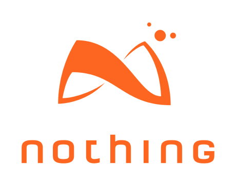

# About this initiative

**The «Accessibility Developer Guide», in its entirety, is the result of many years of hands-on practice in the field of testing websites for accessibility, as well as developing accessible web applications. The daily experience of user experts with special needs, blended together with the profound technical knowledge of fullstack web developers, resulted in forming the «Accessibility Alliance».**

[[toc]]

## «Access for all»

On one side of the «Accessibility Alliance», there is the Swiss Foundation «Access for all», which is the initiator and leader of the whole initiative. It consists of a small team of accessibility experts and web developers, half of which have special needs themselves.

{.zfa-logo}

The foundation has been in business since the year 2000, and since then has guided hundreds of local and international websites in the process of becoming accessible. The basis for this has always been the official guidelines like the [Web Content Accessibility Guidelines](https://www.w3.org/WAI/standards-guidelines/wcag/) (WCAG) and [Accessible Rich Internet Applications](https://www.w3.org/TR/html-aria/) (ARIA), combined with the real-life experiences of the foundation's employees who have special needs, and the profound expertise of fullstack web developers. In one sentence: the contents of this guide are the result of nearly two decades of hands-on experience in all topics accessibility.

> The Accessibility Developer Guide offers easy and free access to a comprehensive and application-oriented knowledge database on the subject of how to build a barrier-free website. The platform aims to share and pass on accessibility know-how to everyone. It is a tangible open source project on ethics in the digital economy. Join in and be part of an exciting community realizing a web for all.

**Sylvia Winkelmann-Ackermann**, CEO, «Access for all».

For more information, see [www.access-for-all.ch](http://access-for-all.ch/).

## Web agencies

On the other side of the «Accessibility Alliance», there are several acclaimed web agencies. They provided the technical solution and visual design for the guide, gave support in marketing it, etc.

### Hinderling Volkart

{.agency-logo}

> Until now, web developers have lacked a good, practical reference on accessibility. It doesn't need more rules, but more guidance to make the web usable for everyone. The Accessibility Developer Guide will provide access where hardly anyone has been before, with practical examples, tested by experts and supported by developers. From the very beginning we were convinced of the purpose of this commitment and are proud to be able to contribute a small part to it.

**Severin Klaus**, Frontend Leader, [Hinderling Volkart](https://www.hinderlingvolkart.com/).

### UNIC

{.agency-logo}

> Accessibility is a complex issue and so equally large effort is required to develop the necessary know-how. That is why we have participated in the establishment of the Accessibility Developer Guide, which will be a key tool in the process of creating accessible websites for everyone in the future. We are looking forward to collaborating with the frontend community so that the development of the Accessibility Developer Guide will be continued.

**Thomas Jaggi**, Expert Frontend Engineer, [UNIC AG](https://www.unic.com/).

### Nothing

{.agency-logo}

> Tim Berners-Lee, the inventor of the World Wide Web once said “The power of the Web is in its universality. Access by everyone regardless of disability is an essential aspect.”. This aspect which can only be fulfilled by the web is ignored by a wide range of people. We feel responsible for what we develop and for who we develop for. With the Accessibility Developer Guide we finally have a practical guide to accessible web development and can contribute our knowledge.

**René Stalder**, Senior Frontend Developer, [Nothing](https://www.nothing.ch/).

### Liip

{.agency-logo}

> As a web agency committed to provide continuous improvements to the way the internet is built and used, Liip is excited to join and contribute to the Accessibility Developer Guide initiative. In our inclusive vision, this will bring benefits to everyone, first to the developers but finally to the end-users. The Open Source nature of the project, furthermore, fully embraces our principles and opens the doors to worldwide contributions.

**Donato Rotunno**, Senior Frontend Developer, [Liip AG](https://www.liip.ch/en).

### Zeix

{.agency-logo}

> The Accessibility Developer Guide allows us to easily share knowledge within the team and build on reliable best practices. This enables us to design, create and program websites that all people like to use.

**Esther Brunner**, User Interface Developer, [Zeix AG](https://zeix.com/).

### Your company here?

Our guide is a community driven resource: everybody is welcome to become a part in the movement of making the Internet a more accessible place.

Please read on.

## Join the «Accessibility Alliance»!

We are a bunch of open-hearted and highly motivated nerds who believe in the potential that technological advancements can have for humanity.

If you feel like you have anything to give to our movement (be it active collaboration, sharing your knowledge, providing financial support, or simply giving some feedback), please get in touch with us through:

- Facebook: [AccessibilityDeveloperGuide](https://www.facebook.com/AccessibilityDeveloperGuide)
- Twitter: [A11yDevGuide](https://twitter.com/A11yDevGuide)

Or drop us a line using the [«Access for all» contact form](http://access-for-all.ch/en/contact.html).

### Contributors

Besides the diligent online community, a group of people regularly physically gathers around developing the Accessibility Developer Guide.

<!--  -->

- **Andreas Moesch**, web developer, Nothing AG.
- **Donato Rotunno**, web developer, Liip AG.
- **Esther Brunner**, web developer, Zeix AG.
- **Graciela Schütz**, senior UX architect, UNIC AG.
- **Joshua Muheim**, web developer & accessibility expert, «Access for all».
- **Jürgen Rudigier**, frontend developer, Hinderling Volkart.
- **René Stalder**, web developer, Nothing AG.
- **Thomas Jaggi**, web developer, former UNIC AG.

Former contributors:

- **Anton Bolfing**, former accessibility expert at «Access for all».
- **Bernhard Heinser**, former CEO at «Access for all».
- **Markus Graf**, web developer.
- **Severin Klaus**, web developer, Hinderling Volkart.

### Testing staff

Not to forget our highly respected testing staff who took care of validating all contents and code examples (all of them working for «Access for all»).

- **Gianfranco Giudice**, blind accessibility expert.
- **Mohamed Sherif**, blind accessibility expert.

Unfortunately not on the picture (beause working remotely) is **Petra Ritter**, multiply-handicapped accessibility expert.

Former testers:

- **Daniele Corciulo**, blind accessibility expert.
- **Romano Spescha**, vision-impaired accessibility trainee.
- **Reto Inniger**, vision-impaired accessibility trainee.
