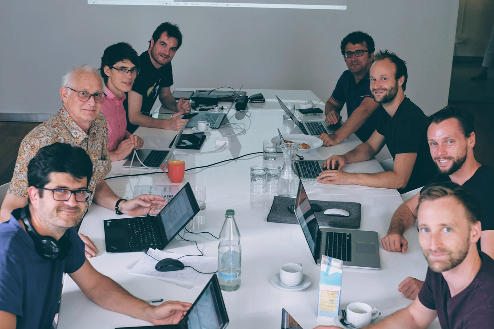

# About this initiative

**The «Accessibility Developer Guide» (ADG) is an initiative of «Access for all», Swiss foundation for technology use for people with special needs. It is developed and maintained in collaboration with a number of acclaimed web agencies. The intent behind the ADG is to bridge the gap between providers of websites and users with special needs.**

## «Access for all»

On one side, there is the Swiss foundation «Access for all», which is the initiator and leader of the whole initiative. It consists of a small team of accessibility experts and web developers, half of which having special needs themselves.

The foundation is in business since the year 2000, and since then has accompanied hundreds of local and international websites in the process of becoming accessible. So the contents of this guide are the result of nearly two decades of hands-on experience in all topics accessibility.

For more information, see [www.access-for-all.ch](http://access-for-all.ch/).

## Web agencies

On the other side, there are several acclaimed web agencies. They provided the technical solution and visual design for the guide, and gave support in marketing it.

### Hinderling-Volkart

> At Hinderling-Volkart, we believe in... TODO

For more information, see [Hinderling-Volkart](https://www.hinderlingvolkart.com/).

### UNIC

> At UNIC, we believe in... TODO

For more information, see [UNIC](https://www.unic.com/).

### Liip

> At Liip, we believe in... TODO

For more information, see [Liip](https://www.liip.ch/en).

### Zeix

> At Zeix, we believe in... TODO

For more information, see [Zeix](https://zeix.com/).

## Join us!

The ADG is a community driven resource: everybody is welcome to become a part in the movement of making the internet a more accessible place.

Clockwise from top right:

- **Donato Rotunno**, web developer at Liip.
- **Joshua Muheim**, web developer and accessibility expert at «Access for all».
- **Jürgen Rudigier**, frontend developer at Hinderling-Volkart.
- **Thomas Jaggi**, web developer at UNIC.
- **Anton Bolfing**, accessibility expert at «Access for all».
- **Bernhard Heinser**, managing director at «Access for all».
- **Esther Brunner**, web developer at Zeix.
- **Markus Graf**, webdesign freelancer.
