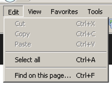
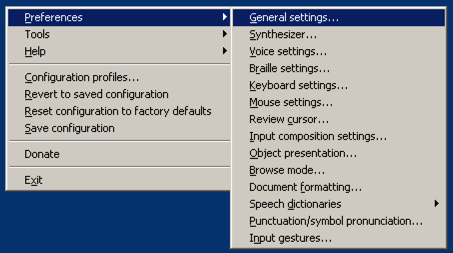

# Controlling a computer with a keyboard only

# Why not use a mouse?

Many users don't use a mouse:

- Either they can't control one due to a motor impairment
- Or they simply don't want to control one as they are power users (see below)

It's crucial to make sure that a website (including all their interactive controls) is controllable with keyboard only:

- If you use standard HTML controls, you're all set (because the browser takes responsibility of making them keyboard accessible)
- If you create custom elements, be sure to make them keyboard accessible yourself!

Be sure to read [Our codex about clean and maintainable accessibility](/knowledge-about-developing-and-testing-accessible-websites/our-codex-about-clean-and-maintainable-accessibility){.page} to find out more about how websites can be implemented in an accessible way with least efforts.

# Keyboard-only navigation

Computers (and all their standard software) can flawlessly be controlled without a pointing device (e.g. a mouse) by using system wide and application specific keyboard shortcuts and quick keys.

## Keyboard shortcuts

Keyboard shortcuts activate certain functionalities, be it system wide or application specific. Keyboard shortcuts always are combinations of at least one modifier key (`Windows`, `Ctrl`, `Alt`, `Shift`) and any other key.

- An example for a system wide keyboard shortcut is `Ctrl + Alt + Del`, which opens the Windows Task Manager
- An example for an application specific keyboard shortcut is `Ctrl + S`, which saves the currently opened document (e.g. in a text editor)

{.image}

Hints about application specific keyboard shortcuts usually are displayed to the right of a menu item.

## Quick keys {.clear}

{.image}

In some menus, a specific character of an item name is <u>underlined</u>: if the menu is open and focused, this means you can quickly activate the item using this key.

# Become a power user: use keyboard shortcuts! {.clear}

Power users know their often used applications' keyboard shortcuts: this makes them much faster than average users as they don't need to use a mouse all the time!

This is a good example for the fact that optimising a website for one particular group (e.g. motor impaired users that can't use a mouse), you often also optimise it for other groups, too (e.g. power users).

So in future, try to always use keyboard shortcuts instead of your mouse!