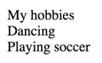
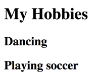

# What are semantics and why are they important for accessibility?

HTML offers a lot of elements that have inherent meaning - so called "semantics".

# Elements without meaning

There are only two elements in HTML that don't have any meaning: `<div>` and `<span>`. Their only purpose is to offer containers needed for visual styling.

The only difference between `<div>` and `<span>` is how they are painted:

- `<div>` is a block element, so it will create a new line between prior and following content
    - This means the browser applies `display: block` to it
- `<span>` is an inline element, so it will stay on the same line with prior and following content
    - This means the browser applies `display: inline` to it

(For more info about CSS' `display` attribute, see [Block vs. Inline Elements](/code-examples-of-common-patterns-and-daily-requirements/block-vs--inline-elements){.page}.)

## Visual vs. aural presentation 

Take a look at the following example:

```html
<div>
  My hobbies
</div>

<div>
  Dancing
</div>

<div>
  Playing
  <span>soccer</span>
</div>
```

{.image}

A visual user agent (web browser) displays such elements' text contents (if any) in their standard font size, line height, color, etc.

An aural user agent (screen reader) simply announces such elements' text contents (if any). This will simply be announced as:

> My hobbies
>
> Dancing
>
> Playing soccer

# Elements with meaning

Let's take a look at the same example, now marked up using headings tags (`<h1>`, `<h2>`, etc.):

```html
<h1>
  My hobbies
</h1>

<h2>
  Dancing
</h2>

<h2>
  Playing soccer
</h2>
```

Marking up text using an `<h#>` tag tells the user agent that this isn't just plain text, but - in fact - a heading of a certain level!

{.image}

A web browser conveys this additional information visually, e.g. by increasing the element's font size, line-height and boldness depending on the heading level.

A screen reader conveys this additional information by announcing the element's meaning:

> My hobbies: heading level 1
>
> Dancing: heading level 2
>
> Playing soccer: heading level 2

(To read more about accessible heading outline, read [Heading outlines](/code-examples-of-common-patterns-and-daily-requirements/heading-outlines){.page}.)

# Semantics provide proper presentation

While visual attributes are important for the visual presentation in web browsers, screen readers don't care about them: regardless whether text has `color: blue` or `color: red`, whether it is `font-size: 1px` or `font-size: 100px`, whether it has a `border` or a `text-shadow`, it's always announced as plain text.

So don't fall for the misbelief that adding visual attributes to non-semantical containers makes up for their missing semantics! Thus never do the following in spite of using proper `<h1>`, `<h2>`, etc. tags:

```css
.h1 {
  font-size: 20px;
}

.h2 {
  font-size: 17px;
}

.h3 {
  font-size: 14px;
}
```

```html
<div class="h1">
  My hobbies
</div>

<div class="h2">
  Dancing
</div>

<div class="h2">
  Playing soccer
</div>
```

Though looking like headings in browsers, screen readers won't announce them as such.

# Semantics provide proper interaction

The following link is properly implemented using the `<a>` tag:

```html
<a href="http://www.google.com">
  Google
</a>
```

A screen reader will announce it like this:

> Google: link

This makes it obvious to the user that it can be activated.

Because many web developers aren't aware of the importance of semantics, instead of using the proper `<a>` tag, things like the following can be seen often:

```html
<!-- Onclick changes window.location using some fancy JavaScript! -->
<span onclick="...">
  Google
</span>
```

This way the element won't be announced as link - so the user probably will never try to click it. Some screen readers may announce it as "clickable", but this still doesn't say much about the purpose of the element.

In addition, the element won't be usable using a keyboard only: while a proper `<a>` tag can be focused, a `<span>` can't. Sure, you could also find a way around this, but chances are high you'll always forget about manually addressing some lesser known features of the tags you try to reconstruct. So why not use the proper tag in the first place?

# Semantics are very, very, VERY important

Proper semantics provide a lot of functionality to all kind of devices. If they're incorrect or even missing, they destroy the user experience and often create limits beyond remedy for many users.

Many of today's problems regarding accessibility are linked to developer's not knowing the most basic HTML fundamentals.

Caring for proper semantics will make you a so much more exquisite frontend developer than you could ever imagine. Trust us.

To learn more about how to develop high quality, maintainable, accessible websites, read [Our codex about clean and maintainable accessibility](/knowledge-about-developing-and-testing-accessible-websites/our-codex-about-clean-and-maintainable-accessibility){.page}