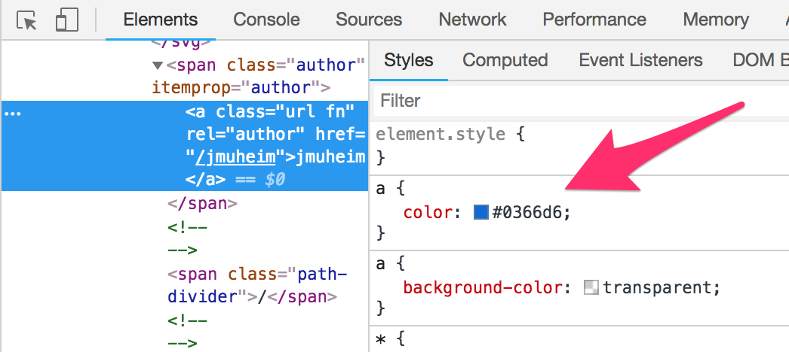

# How to precisely examine colours

**While calculating contrast ratios is a somewhat complex thing, fortunately there are tools that accomplish this automatically. We only need to feed such a tool with correct colour codes - which has a few potential pitfalls that you need to avoid.**

Fortunately, no manual calculation of contrast ratios between two colours is needed today, as there are a lot of automatic tools for this purpose. We recommend using the Colour Contrast Analyser (CCA), so if you haven't done this yet, go back and read [Colour Contrast Analyser](/setup/helper-tools/colour-contrast-analyser/)).

By entering a foreground and a background colour into the respective fields, the CCA immediately states whether those have a sufficient contrast ratio (depending on the kind of visual content and its size).

When calculating a contrast ratio, it is very important that the "right" colour codes are used (which means the colour definitions that are effectively defined in the CSS). But what is the best way to do this?

## DOM inspector

The most trustworthy source for this is the browser's DOM inspector.

To do this, right-click on an element and choose `Inspect`. Now you can find the element's colour value in the `Styles` tab, like `color: #00FF00`.

Now simply copy the colour code and paste it into CCA.

## Colour picker

A lot of contrast checkers offer colour pickers. While they are very handy, they open up some potential pitfalls.

### Anti-aliasing

Most modern browsers try to offer a smoother visual experience by applying anti-aliasing to rendered elements (see [Anti-aliasing (Wikipedia.org)](https://en.wikipedia.org/wiki/Anti-aliasing)).

When you are picking a colour from such an element, be sure to avoid anti-aliased areas, as this would have a drastic impact on the result.

### Colour profiles

Also be aware that sometimes a colour that is displayed on screen may slightly differ from its definition in the code. This is due to the various colour profiles that are used by monitors, operating systems and browsers.

So if you are using colour pickers, the picked colour may differ from its true definition.

## Conclusion

Working with colour pickers can save a lot of time.

In general though: if a result is very close to the required contrast limit, we recommend to re-check by examining the real colour definitions from the DOM inspector.
