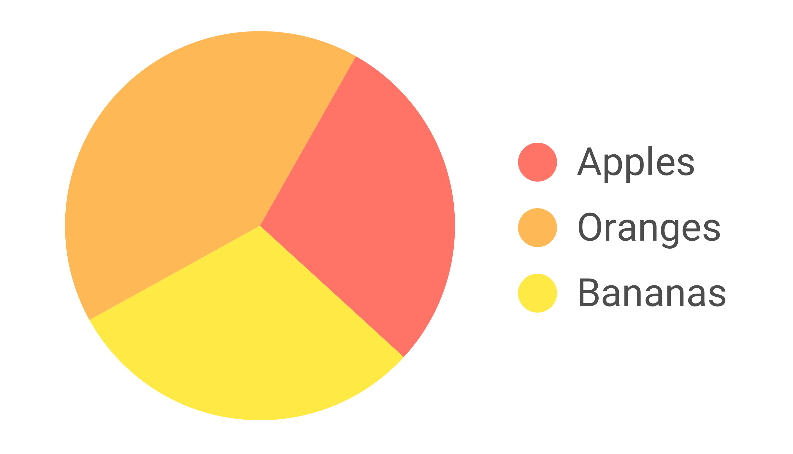
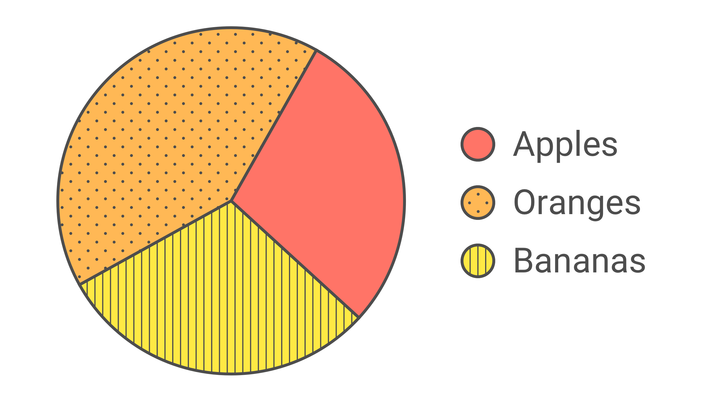
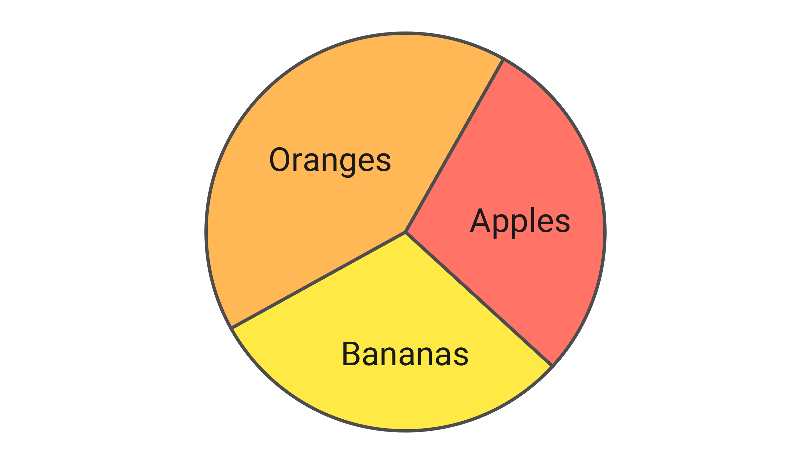

# Colour is not enough

**The purpose of contrast is allowing people to see and distinguish different parts of an interface. Colour is an important factor in this context, but it has some clear limitations. That is why relying on colour alone is usually not a good strategy.**

[[toc]]

## Limitations of colour contrast

Colour is a great tool for separating foreground from background. However, there are many cases where being visible against a background is not enough. Different elements of a user interface or a component also have to be distinguishable *from each other.* And while finding a combination of two colours with sufficient contrast is easy, finding three, four or even more colours with sufficient contrast from each other quickly becomes impractical if not impossible. 

The [Web Content Accessibility Guidelines' rule on the use of colour](https://www.w3.org/TR/WCAG21/#use-of-color) therefore states:

> Colour is not used as the only visual means of conveying information, indicating an action, prompting a response, or distinguishing a visual element. 

## Example: current page indicator

The following picture shows a navigation bar that could be placed at the top of the page.

While all the labels have sufficient contrast against the white background, the colour of the active "Shop" label and the colour of the inactive labels around it only have a contrast ratio of `1.7:1`. This is how this same navigation would look in grayscale. 

Someone who can't perceive colour differences very well – because of their eye sight, their screen or the surrounding light – will have a hard time spotting which item is currently selected.

This problem can be solved by adding one or more visual alterations to the active element that have nothing to do with changing its colour. E.g. one could change the font weight or underline the active label.

Now, even with no colour perception at all, the item is still clearly distinguishable.

Finally, let's keep in mind that beyond visual appearance the differentiation also has to be encoded in the underlying markup. It should provide adequate semantic information to clearly differentiate elements also on a non-visual level. One way to do this is to add a visually hidden text snipped that indicates the active status of the label.

For more information about hiding elements visually while keeping them accessible to screen readers see [Hiding elements visually by moving them off-screen](/examples/hiding-elements/visually/).

## Example: pie chart

Visual charts are a frequent example where colours are used to convey meaning. For example this simple pie chart with three differently coloured sections, labelled in a separate legend.

- Apples (red)
- Oranges (orange)
- Bananas (yellow)

The three colours of the pie chart don't have enough contrast against the white background. And just as important in this case is the fact that they also don't have enough contrast *against each other*.

- Red/orange = `1.5:1`
- Orange/yellow = `1.4:1`
- Yellow/red = `2.4:1`

This is due to the fact that contrast is primarily about difference in luminance and not about difference in tone (for more information see [Calculate colour contrast](/knowledge/colours-and-contrast/how-to-calculate/)).

First, let's add a clearly visible outline around the coloured areas.

Now, the pie chart stands out against the white background and it's clear that it has in fact three sections. But due to the low contrast between the three colours it can still be very challenging for certain people to assign the labels to the sections in the pie chart.

Adding distinct visual patterns can make the visual link accessible.

Or in charts as simple as this one it's also possible to forego a separate legend and place the labels directly inside the sections. As long as the contrast between the label and the background colour of the section satisfies the [contrast requirements for text](/knowledge/colours-and-contrast/text/) this might be the most straight-forward solution.

Obviously, not all charts are as simple as this example. For more complex information graphics it's fine (or even necessary) to focus on the elements which are essential to understand the message of the visualisation. 
