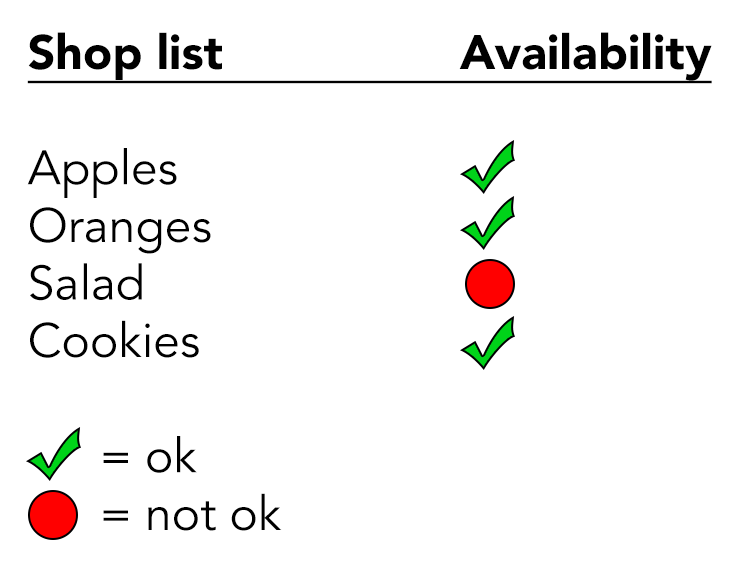
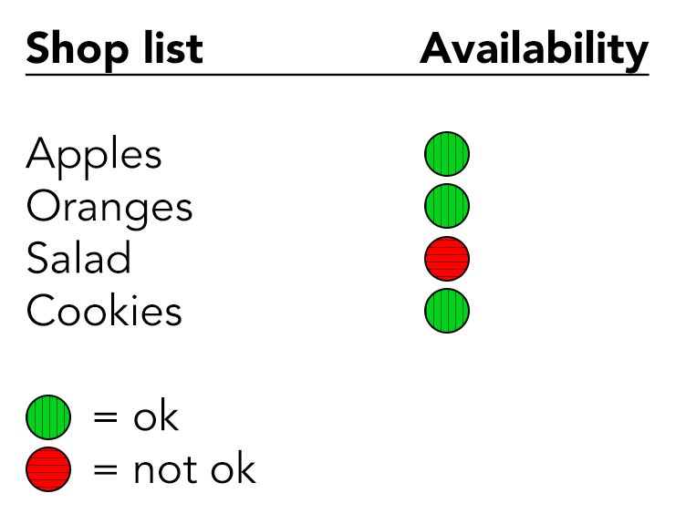

# Colours and meaning

**TODO**

Colours are often used to convey something to users. For example, in Western culture, green usually is associated with "okay" or "available", whereas red is associated with "danger" or "out of stock".

Like with other graphical objects, such elements that convey meaning through specific colours need to be distinguishable, so they need a proper colour contrast of `3:1`.

## The problem

In the following example, the availability status of elements in a shop list is indicated using a red or green dot; green standing for "ok", red standing for "not ok".

The red and green colours have a contrast ratio of `2.0:1`, which is not sufficient. Alas, a user with a severe colour deficiancy would not be able to recognise whether an element is available or not.

You could try to fix the problem by experimenting with the colours until you find a combination with enough contrast. But this would probably suffer the visual design - and as additional statuses occur, this quickly becomes a dead-end.

By the way: always be careful with meaning conveyed solely through colour! In other cultures, colours may be used differently to yours. Alas, always offer a legend with descriptive texts so the meaning is independent from cultural backgrounds.

## Possible solutions

### Adding text information

You could simply add text information to each dot, conveying its status. This would even render the legend obsolete.

In general though, this somehow feels like redundant information.

### Adding shape information

Instead of simply using a coloured dots, we could use a different shape for each status.

In the following example, a tick sign is used for "ok", and a dot for "not ok".

### Adding pattern information

Another possible solution is to use a different pattern for each status.

In the following example, a vertical pattern is used for "ok", and a horizontal one for "not ok".

