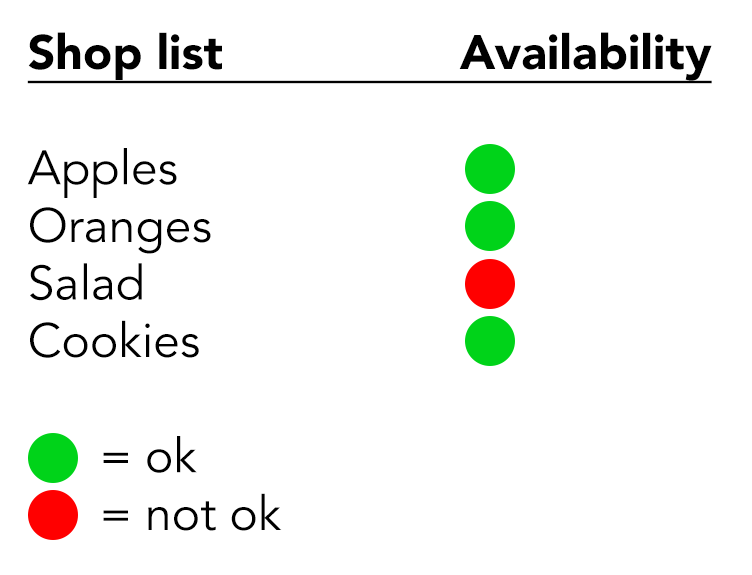
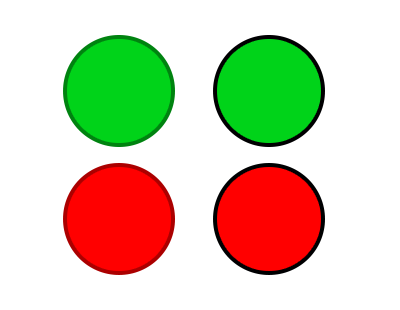
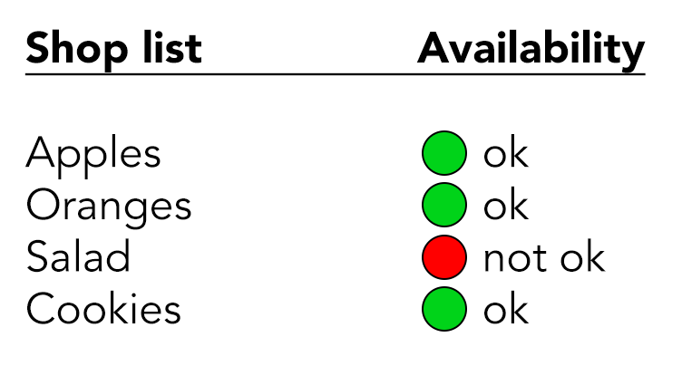
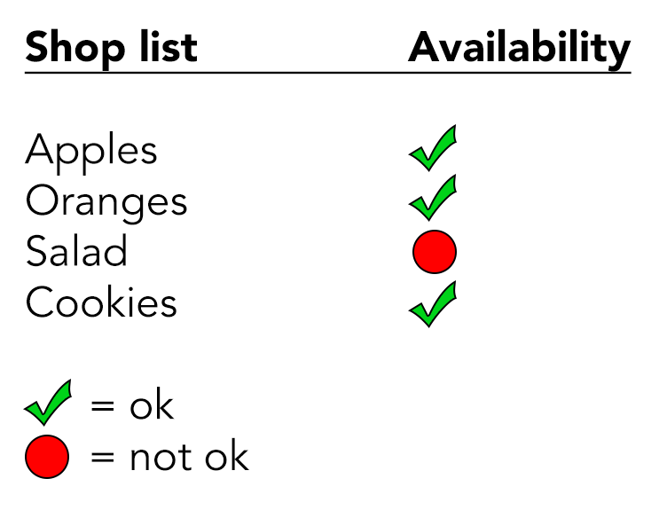
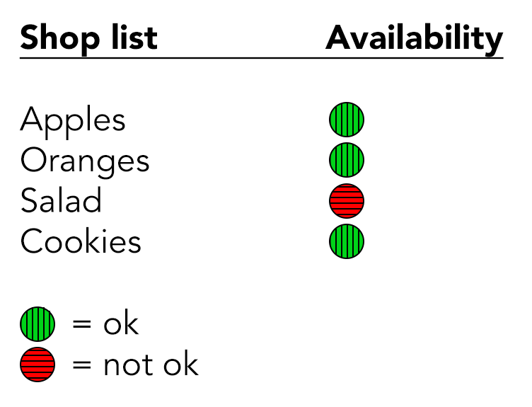
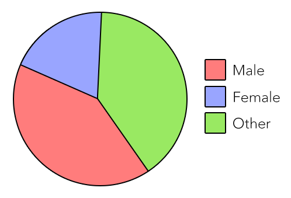
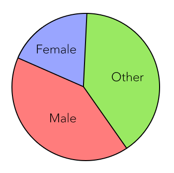
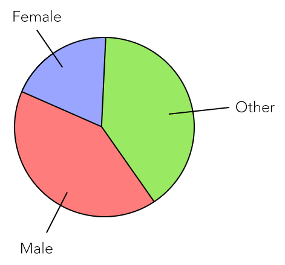
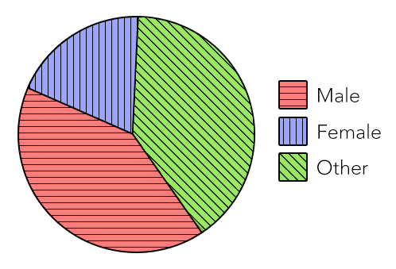

# Contrast requirements of graphical objects

**The term “graphical object” typically applies to stand-alone icons and to information graphics. One of the particular challenges here comes from the fact that visual differentiation has to be possible between many more elements than just foreground and background.**

## Minimal contrast ratio
The [Web Content Accessibility Guidelines (WCAG) specify a minimal contrast ratio](https://www.w3.org/TR/WCAG21/#non-text-contrast) of `3:1` against adjacent colour(s) for graphical objects.

## Example: Status indicator

In the following example, the availability status of elements in a shop list is indicated using a red or green dot; green standing for “ok”, red standing for “not ok”.

### Improving perceivability

First of all: while the red colour has a contrast of `4:1` (which is good), the green colour has only a contrast of `2.1:1` (which is not enough).

An easy way to improve this is to add borders around the elements:

- either in a darker green (and, if wanted, red), as seen on the left side of the following screenshot.
- or by any other colour that has enough contrast (like black), as seen on the right side of the following screenshot.

Let’s stick with the black borders for the time being.

Now the elements are clearly perceivable - but can they be distinguished from each other?

### Improving distinctiveness

The red and green colours have a contrast ratio of `2:1`, which is not sufficient. A user with a severe colour deficiancy would not be able to recognise whether an element is available or not.

One possible way to address this issue is to find colour combinations with enough contrast. However, this might not be easily doable if the colours are predefined in a styleguide or corporate design manual. Additionally, this can turn out to be a dead-end once a third possible status (for example yellow) is added.

By the way: Always be careful with meaning conveyed solely through colour! Depending on the cultural context a colour’s implicit meaning may vary. Always offer a legend with descriptive texts so that the meaning is made explicit.

#### Adding text information

You could simply add text information to each dot, conveying its status. This would even render the legend obsolete.

This works but to some this might feel like a lot of redundant information.

#### Adding shape information

Instead of simply using coloured dots, we could use a different shape for each status.

In the following example, a tick sign is used for “ok”, and a dot for “not ok”.

#### Adding pattern information

Another possible solution is to use a different pattern for each status.

In the following example, a vertical pattern is used for “ok”, and a horizontal one for “not ok”.

Needless to say that such patterns also need to have enough contrast.

## Example: Charts

Visual charts are another frequent example where colours are used to convey meaning. For example this simple pie chart: It has three differently coloured sections which are labelled in a separate legend.

- Male (red)
- Female (blue)
- Other (green)

To a visually non-impaired user, this pie chart should not pose any problem. But the colour contrasts are way too low:

- Red/blue is `1.1:1`
- Blue/green is `1.5:1`
- Green/red is `1.7:1`

This is due to the fact that contrast is primarily about difference in luminance and not about difference in tone (for more information see [Calculate contrast](/knowledge/colours-and-contrast/formula/)). Because of that you will quickly run out of high-contrast combinations if you rely solely on colour. Let’s instead use some of the techniques we have discussed in the previous example.

First, let’s add a clearly visible stroke around the sections.

It is now clear that there are in fact three sections. But the visual link between the sections in the chart and their respective label in the legend is not accessible yet. To make up for this, you can either place the labels right inside the sections…

… or draw lines to connect the sections with their respective label.

And again, adding background patterns can be very useful.

Obviously not all charts are as simple as this example. For more complex information graphics it’s fine (or even necessary) to focus on the elements which are essential to understand the message of the visualisation. 

## Don’t rely solely on colours

Graphical objects can have a comparatively high number of distinct elements. While it is possible to create colour combinations with enough contrast, it’s often easier and more robust to use shapes, patterns or other additional visual indicators for differentiation. Relying on colour alone to convey meaning is generally a weak strategy; for graphical elements specifically it is often simply not practical.