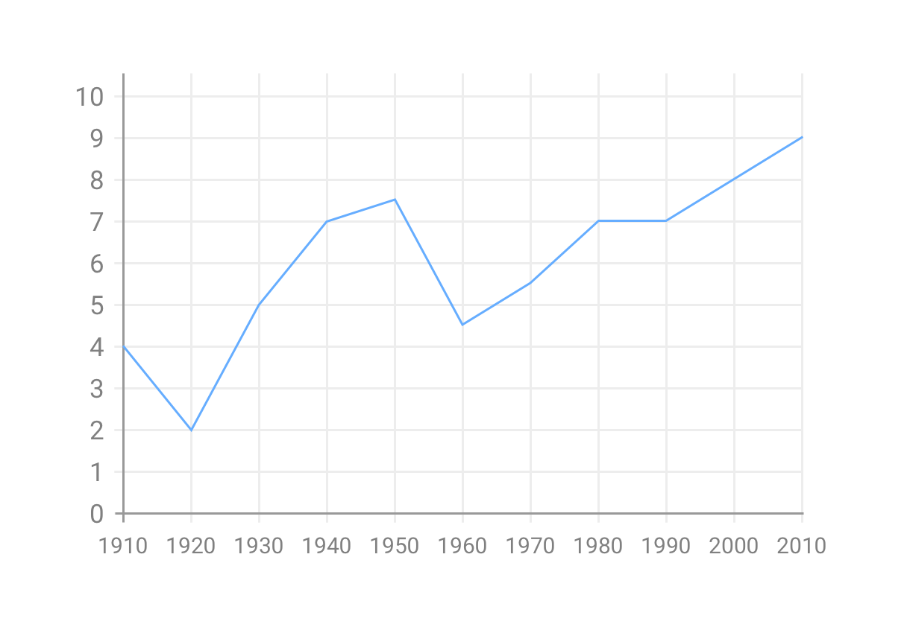
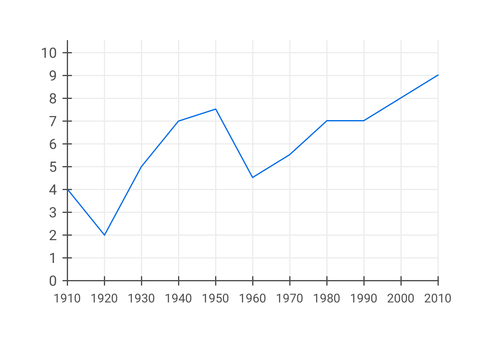
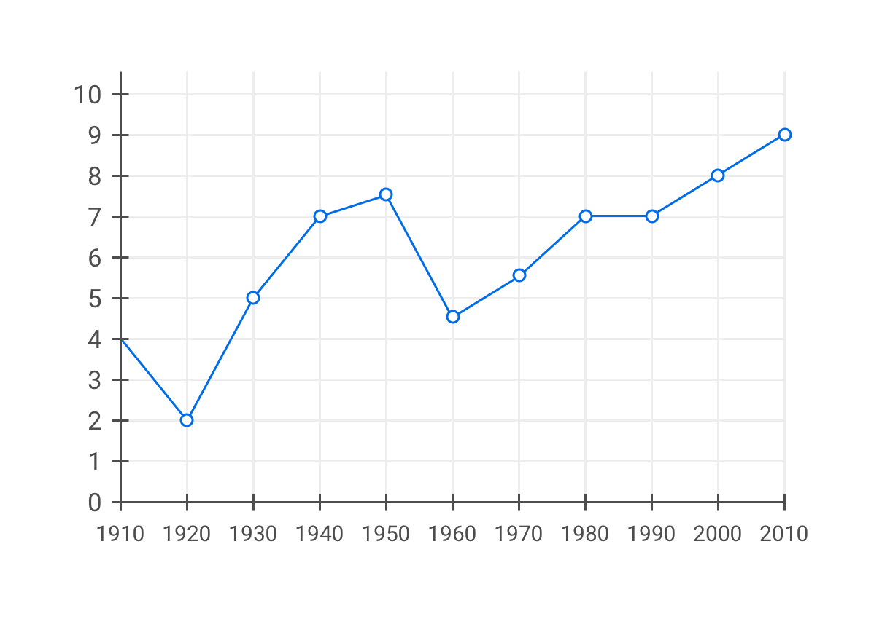
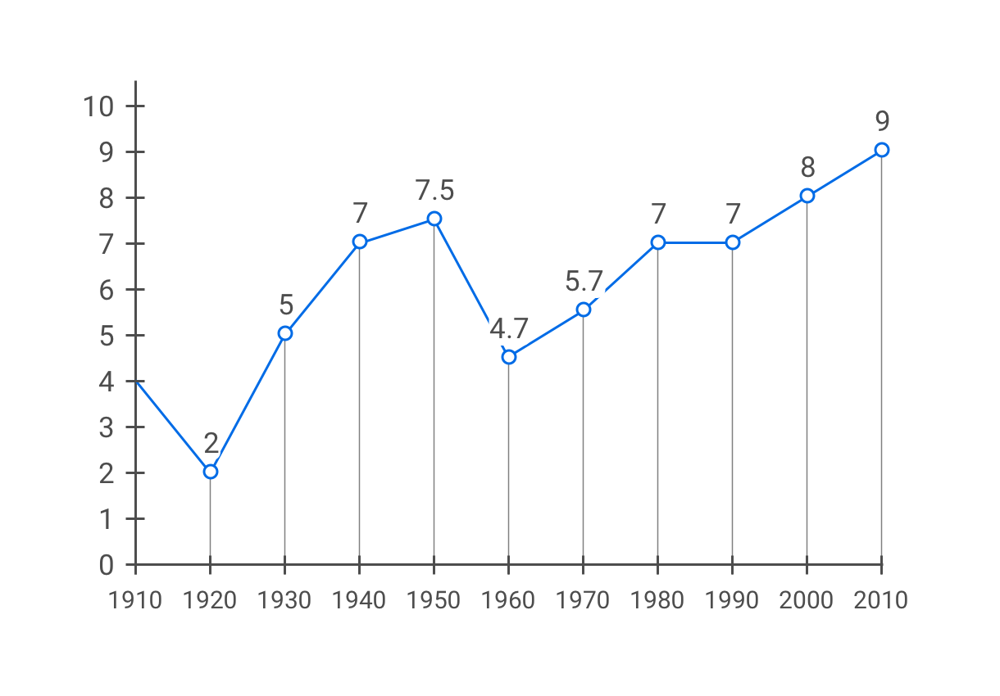

# Colour contrast for graphical objects

**The term "graphical object" typically applies to stand-alone icons and to information graphics. The visual complexity of such objects often requires some differentiation with regards to contrast. The focus lies on the parts of the graphical object required to understand the content.**

[[toc]]

## Minimal contrast ratio

Version 2.1 of the Web Content Accessibility Guidelines (WCAG) specify a [minimal contrast ratio of `3:1` against adjacent colour(s)](https://www.w3.org/TR/WCAG21/#non-text-contrast) for the parts, which are required to understand the meaning or content of a graphical object.

## Example: line chart

The following picture shows a simple line chart with overall insufficient contrast. 

The contrast ratio of the main X and Y axis is `2.8:1`, the one of blue trend line is `2.3:1`. The text labels along the X and Y axis have a contrast ratio of `3.9:1` which can also be considered too low because [text has to meet a higher contrast requirement](/knowledge/colours-and-contrast/text) of at least `4.5:1`. All of these values are somewhat close to their formal requirements but it's important to keep in mind that those requirements only set **minimal** standards. 

Let's increase the contrast ratio of the aforementioned elements.

The question now is, what should happen with the grid lines in the background. Their contrast ratio is far too low, yet increasing it might result in a visually overloaded chart.

This brings us back to the notion of what is "required to understand the meaning or content" of this chart. 

If the purpose of the chart is to just show a general trend, the grid lines might not be required. In that case, why not just remove them altogether? (If that feels like a loss, this might not be the right solution.)

However, if it is in fact important that people can comfortably read the exact values of each measuring point, it might be a good start to mark those points.

Horizontal grid lines might make it easer to gauge the value of the measuring point without overloading the overall appearance.

Or why not add a label to each measuring point, indicating its value?

It's no coincidence that many of these considerations and adjustments go far beyond just colour contrast. Designing accessible user interfaces requires a holistic approach. This means:

- There is rarely a single variable that can be independently tweaked. Accessibility should be built into the foundations of the design.
- There is rarely one generic solution that "just works". The specific context and content have to be taken into account.
- There is no strict separation between "special-purpose accessibility" and "general-purpose usability". In practice they both influence each other.